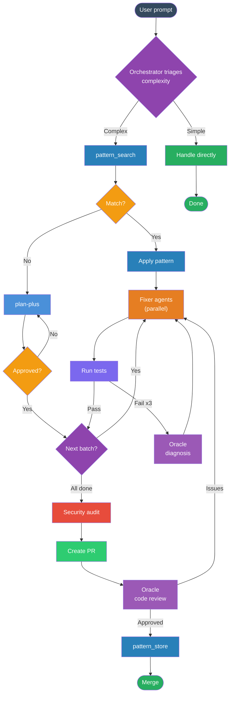

<div align="center">

# lean-flow

**Lightweight dev workflow plugin for Claude Code**

*Same workflow as ruflo/claude-flow. 3 tools instead of 300+. 1/60th the token cost.*

[](LICENSE)
[](https://claude.ai/claude-code)
[](https://github.com/helmiatwork/lean-flow/pulls)

</div>

---

## Why lean-flow?

Frameworks like [ruflo](https://github.com/ruvnet/ruflo) and [oh-my-opencode-slim](https://github.com/ruvnet/oh-my-opencode-slim) register **300+ MCP tools** and fire multiple hooks per message. Most tools are never called, but they still consume **~3000 tokens/session** just by existing.

lean-flow extracts the **7 actually useful features** and implements them with native Claude Code capabilities.

| | ruflo | lean-flow |
|:---|:---:|:---:|
| MCP tools registered | 300+ | **3** |
| Tokens/session overhead | ~3,000 | **~100** |
| Tokens/message overhead | ~600 | **~50** |
| Hooks per prompt | 5-8 | **1** |
| Pattern memory | JSON files | **SQLite + FTS5** |
| Agent orchestration | Custom swarm | **Native Agent tool** |

---

## Features

### 🧠 Pattern Memory
SQLite database with FTS5 full-text search. Save solved patterns, retrieve them before re-solving.

| Tool | Purpose |
|:-----|:--------|
| `pattern_search` | Find previously solved patterns by keyword |
| `pattern_store` | Save problem + solution pairs after success |
| `project_context` | Store/retrieve project summary & conventions |

### 🤖 Parallel Agents

| Agent | Model | Role |
|:------|:-----:|:-----|
| **Oracle** | Opus | Architecture review, code review, stuck diagnosis |
| **Fixer** | Sonnet | Implementation, bug fixes, tests |
| **Librarian** | Sonnet | Docs lookup, web search, research |
| **Designer** | Sonnet | UI/UX, frontend components |
| **Explorer** | Haiku | File discovery, codebase navigation |

### 🔒 Safety Hooks
- **Block** direct push to `main` / `master` / `staging`
- **Block** `--no-verify` flag on git commands
- **Auto-allow** workflow tools (Agent, Tasks, PlanMode) — no permission prompts

### 📊 Usage Monitor *(macOS)*
SwiftBar menu bar plugin showing real-time Claude Code usage:
- Session %, weekly %, sonnet % with reset countdown
- Color-coded: 🟢 <50% · 🟡 50-80% · 🔴 >80%
- Auto-refresh via launchd daemon (every 3 min)

### 🎭 E2E Testing
Auto-installs [Playwright MCP](https://github.com/anthropics/anthropic-quickstarts/tree/main/mcp-playwright) for browser automation testing.

### 💤 Auto-Dream
Background memory consolidation using Haiku. Runs every 5 sessions / 24 hours. Cleans up stale memories, merges duplicates, prunes outdated entries.

---

## Workflow



<details>
<summary><strong>Workflow steps explained</strong></summary>

1. **Triage** — Simple tasks handled directly. Complex tasks go to pattern search.
2. **Pattern Search** — Check if this problem was solved before. If yes, reuse the pattern.
3. **Plan** — Generate structured plan via [plan-plus](https://github.com/RandyHaylor/plan-plus). User reviews and approves.
4. **Execute** — Dispatch parallel Fixer agents for independent steps. Run tests after each batch.
5. **Retry** — Failed tests retry twice. Third failure escalates to Oracle for diagnosis.
6. **Audit** — Security scan + diff risk analysis on the full branch diff.
7. **PR + Review** — Create PR, Oracle reviews code quality + description.
8. **Learn** — Save successful patterns via `pattern_store` for future sessions.

</details>

---

## Quick Start

### 1. Enable the plugin

Add to `~/.claude/settings.json`:

```json
{
  "extraKnownMarketplaces": {
    "lean-flow": {
      "source": {
        "source": "github",
        "repo": "helmiatwork/lean-flow"
      }
    }
  },
  "enabledPlugins": {
    "lean-flow@lean-flow": true
  }
}
```

### 2. Start a session

Everything else is **automatic**. On first session, lean-flow will:

| Step | What gets installed | Time |
|:-----|:-------------------|:----:|
| 🧠 Knowledge MCP | SQLite + FTS5 pattern memory (3 tools) | ~10s |
| 🔌 Companion Plugins | superpowers + plan-plus (auto-enabled) | ~1s |
| 🔒 Permissions | Auto-allow workflow tools, block protected branches | ~1s |
| 🎭 Playwright | `@playwright/mcp` + Chromium browser | ~30s |
| 📊 Usage Monitor | SwiftBar + launchd fetcher *(macOS only)* | ~15s |
| 📋 Session Briefing | Git state summary | ~1s |

> **Subsequent sessions:** All checks run but skip in <100ms total (idempotent).

### 3. Companion plugins (auto-configured)

lean-flow automatically enables these companion plugins on first session:

| Plugin | Source | Purpose |
|:-------|:-------|:--------|
| **superpowers** | [claude-plugins-official](https://github.com/anthropics/claude-code-plugins) | Skills & workflows (brainstorming, TDD, debugging, etc.) |
| **plan-plus** | [RandyHaylor/plan-plus](https://github.com/RandyHaylor/plan-plus) | Structured planning with skeleton + step files |

> No manual configuration needed. Restart session after first install to activate.

---

## What's Inside

```
lean-flow/
├── .claude-plugin/
│   └── plugin.json              # Plugin metadata
├── agents/
│   ├── oracle.md                # Opus — code review, architecture
│   ├── fixer.md                 # Sonnet — implementation
│   ├── librarian.md             # Sonnet — research, docs
│   ├── designer.md              # Sonnet — UI/UX
│   └── explorer.md              # Haiku — codebase navigation
├── hooks/
│   └── hooks.json               # SessionStart, PreToolUse, PostToolUse, Stop
├── scripts/
│   ├── ensure-knowledge-mcp.sh  # Auto-install SQLite pattern memory
│   ├── ensure-permissions.sh    # Auto-configure workflow permissions
│   ├── ensure-playwright-mcp.sh # Auto-install Playwright + Chromium
│   ├── ensure-claude-monitor.sh # Auto-install SwiftBar usage monitor
│   ├── block-protected-push.sh  # Block push to main/master/staging
│   ├── block-no-verify.sh       # Block --no-verify bypass
│   ├── session-briefing.sh      # Git state on session start
│   ├── auto-dream.sh            # Memory consolidation (background)
│   ├── auto-dream-prompt.md     # Dream agent instructions
│   └── claude-monitor/          # SwiftBar plugin + fetcher daemon
├── workflows/
│   └── standard-development-flow.md
├── mcp-servers/
│   └── knowledge/               # SQLite + FTS5 MCP server
│       ├── index.mjs
│       └── package.json
└── README.md
```

---

## Inspired By

> lean-flow stands on the shoulders of these projects — taking their best ideas and distilling them into a lightweight plugin.

- **[ruflo](https://github.com/ruvnet/ruflo)** — Enterprise AI agent orchestration with 60+ agent types
- **[oh-my-opencode-slim](https://github.com/ruvnet/oh-my-opencode-slim)** — OpenCode/Claude Code enhancement framework
- **[plan-plus](https://github.com/RandyHaylor/plan-plus)** — Plan mode optimizer (recommended companion)

---

<div align="center">

**MIT License** · Made by [helmiatwork](https://github.com/helmiatwork)

</div>
