<div align="center">

# lean-flow

**Lightweight dev workflow plugin for Claude Code**

*Same workflow as ruflo/claude-flow. 6 tools instead of 300+. 1/60th the token cost.*

[](LICENSE)
[](https://claude.ai/claude-code)
[](https://github.com/helmiatwork/lean-flow/pulls)

</div>

---

## Why lean-flow?

Frameworks like [ruflo](https://github.com/ruvnet/ruflo) and [oh-my-opencode-slim](https://github.com/ruvnet/oh-my-opencode-slim) register **300+ MCP tools** and fire multiple hooks per message. Most tools are never called, but they still consume **~3000 tokens/session** just by existing.

lean-flow extracts the **7 actually useful features** and implements them with native Claude Code capabilities.

| | ruflo | lean-flow |
|:---|:---:|:---:|
| MCP tools registered | 300+ | **6** |
| Tokens/session overhead | ~3,000 | **~100** |
| Tokens/message overhead | ~600 | **~50** |
| Hooks per prompt | 5-8 | **1** |
| Pattern memory | JSON files | **SQLite + FTS5** |
| Agent orchestration | Custom swarm | **Native Agent tool** |

---

## Features

### 🧠 Pattern Memory
SQLite database with FTS5 full-text search. Save solved patterns, retrieve them before re-solving.

| Tool | Purpose |
|:-----|:--------|
| `pattern_search` | Find previously solved patterns by keyword |
| `pattern_store` | Save problem + solution pairs after success |
| `pattern_list` | List all patterns for a project |
| `pattern_delete` | Remove stale or incorrect patterns |
| `pattern_stats` | Show usage statistics across all projects |
| `project_context` | Store/retrieve project summary & conventions |

### 🤖 Parallel Agents

| Agent | Model | Role |
|:------|:-----:|:-----|
| **Oracle** | Sonnet | Architecture review, code review, stuck diagnosis |
| **Coder** | Sonnet | Complex features, logic, new patterns |
| **Fixer** | Haiku | Simple/mechanical: copy patterns, rename, delete dead code |
| **Auditor** | Sonnet | Security scan, diff risk, vulnerability detection |
| **Tester** | Sonnet | Dedicated test writer, coverage improvement |
| **Librarian** | Sonnet | Docs lookup, web search, research |
| **Designer** | Sonnet | UI/UX, frontend components |
| **Explorer** | Haiku | File discovery, codebase navigation |

### 🌿 Branch Naming Convention

| Prefix | Use |
|:-------|:----|
| `feature/` | New functionality |
| `fix/` | Bug fixes |
| `improvement/` | Refactors, performance |
| `security/` | Security patches |
| `test/` | Test-only changes |
| `docs/` | Documentation |
| `chore/` | Dependencies, CI, config |
| `hotfix/` | Urgent production fixes |
| `release/` | Release prep, version bumps |
| `experiment/` | Spikes, prototypes (may discard) |
| `revert/` | Reverting a bad merge |

Steps append `/step-N`: `feature/onboarding/step-1`

### 🔒 Safety Hooks
- **Block** direct push to `main` / `master` / `staging`
- **Block** `--no-verify` and `--no-gpg-sign` flags on git commands
- **Block** staging secret files (`.env`, credentials) — warns on `git add .`
- **Block** Claude identity in commits and PRs (Co-Authored-By, attribution)
- **Block** saving plans to wrong directory (`docs/superpowers/plans/`)
- **Auto-allow** workflow tools (Agent, Tasks, PlanMode) — no permission prompts

> These hooks enforce rules at the shell level (exit code 2 = block). Zero token cost — no prompt instructions needed.

### 📊 Usage Monitor *(macOS)*
SwiftBar menu bar plugin showing real-time Claude Code usage:
- Session %, weekly %, sonnet % with reset countdown
- Color-coded: 🟢 <50% · 🟡 50-80% · 🔴 >80%
- Auto-refresh via launchd daemon (every 3 min)

> **Note:** The usage monitor requires macOS + SwiftBar. On Linux, you can manually check usage with `claude /usage` or read `/tmp/claude-usage-cache.json` if the fetcher is running.
>
> **macOS permission:** The fetcher daemon runs `node` to access Claude's usage data. If you see a *"node would like to access data from other apps"* dialog, go to **System Settings → Privacy & Security → App Management** and toggle **Allow** for `node`. If `node` isn't listed, click **+** and navigate to `/opt/homebrew/bin/node` (or wherever `which node` points). This is a one-time setup.

### 🗺️ Cartography (Repository Mapping)
Generate hierarchical codemaps for fast agent orientation. Instead of explorer agents scanning file-by-file (~3K tokens), agents read `codemap.md` (~200 tokens).

- **`/cartography`** — invoke the skill to map a repo
- `cartographer.py init` — scan repo, create `.slim/cartography.json` + empty `codemap.md` per folder
- `cartographer.py changes` — detect what changed since last mapping
- `cartographer.py update` — refresh hashes after codemaps are updated
- Auto-detects changes on session start and prompts to update affected codemaps
- Root `codemap.md` serves as the **Repository Atlas** — master entry point for all agents

> Inspired by [oh-my-opencode-slim cartography](https://github.com/alvinunreal/oh-my-opencode-slim/blob/master/docs/cartography.md). Requires `python3`.

### 🎭 E2E Testing
Auto-installs [Playwright MCP](https://github.com/anthropics/anthropic-quickstarts/tree/main/mcp-playwright) for browser automation testing.

### 🎯 Skills (via superpowers plugin)

lean-flow auto-enables the [superpowers](https://github.com/anthropics/claude-code-plugins) plugin which provides these skills used in the workflow:

| Skill | When it's used |
|:------|:---------------|
| `cartography` | Map a codebase — generates per-folder `codemap.md` for fast agent orientation |
| `brainstorming` | Before any creative/feature work — explores intent and design |
| `writing-plans` | When creating implementation plans (feeds into plan-plus) |
| `test-driven-development` | Before writing implementation code |
| `systematic-debugging` | When encountering bugs or test failures |
| `verification-before-completion` | Before claiming work is done or creating PRs |
| `receiving-code-review` | When processing oracle's review feedback |
| `finishing-a-development-branch` | When implementation is complete, deciding merge/PR/cleanup |
| `using-git-worktrees` | When feature work needs isolation from main workspace |

> Skills are invoked automatically when their context matches. No manual activation needed.

### 📺 Live Plan Viewer
Auto-opens a browser dashboard at `localhost:3456` when you exit plan mode. Shows all plans grouped by repo with real-time updates.

- **Two-panel layout** — sidebar with repos + plans, main panel with step details
- **Live reload** — file watcher + Server-Sent Events, updates instantly when steps are checked off
- **Sorted** — incomplete plans on top (lowest progress first), completed at bottom
- **20 per repo** — "Show more" button for older plans
- **Status indicators** — 🟢 complete, 🟡 in progress, ⚫ not started

The viewer runs as a background server. Starts automatically on first plan exit, reuses existing server on subsequent exits.

### ⚡ RTK (Rust Token Killer)
Auto-installs [RTK](https://www.rtk-ai.app) — a Rust CLI proxy that rewrites Bash commands to token-optimized equivalents. Typical savings: **40-90% fewer output tokens** on dev operations.

- `git status`, `ls`, `find`, `grep`, `diff` → compact RTK output
- Transparent — no prompt changes needed, works via PreToolUse hook
- Check savings anytime: `rtk gain`

> RTK is auto-installed on first session (via brew or curl fallback). Disable with `"enable": { "rtk": false }` in `~/.claude/lean-flow.json`.

### 💤 Auto-Dream
Background memory consolidation using Haiku. Runs every 5 sessions / 24 hours. Cleans up stale memories, merges duplicates, prunes outdated entries.

---

## Workflow

```mermaid
flowchart TD
    USER(["👤 User prompt"]) --> TRIAGE

    TRIAGE{"🎯 Orchestrator\ntriages complexity"}
    TRIAGE -->|"Simple"| DIRECT["Orchestrator\nhandles directly"]
    TRIAGE -->|"Complex"| MEMORY
    TRIAGE -->|"Greenfield 🌱"| GREENFIELD

    %% === GREENFIELD PATH ===
    GREENFIELD["🌱 Brainstorm\nproduct concept"] --> GENDOCS
    GENDOCS["📄 Generate docs\n(PRD, HLA, TRD, DB, API)"] --> PLANMODE

    %% === HOTFIX PATH ===
    TRIAGE -->|"Hotfix 🔥"| HOTFIX
    HOTFIX["🔥 hotfix/ branch\nfrom main"] --> HOTFIXFIX["🔧 Fixer\nMinimal fix + test"]
    HOTFIXFIX --> HOTFIXPR["PR hotfix → main\n🔮 Oracle inline review"]
    HOTFIXPR --> HOTFIXDONE(["✅ Merge"])

    MEMORY["🧠 pattern_search\nKnowledge MCP"] --> FOUND

    FOUND{"Match?"}
    FOUND -->|"Yes"| ADAPT["Apply pattern"]
    FOUND -->|"No"| BRAINSTORM

    ADAPT --> BRANCH
    DIRECT --> DONE(["✅ Done"])

    BRAINSTORM["💡 Brainstorming"] --> PLANMODE

    PLANMODE["📋 EnterPlanMode"] --> QUALITY

    QUALITY["✍️ writing-plans\nquality guidance"] --> WRITE

    WRITE["Write plan"] --> REVIEW

    REVIEW{"Approved?"}
    REVIEW -->|"No"| WRITE
    REVIEW -->|"Yes"| EXITPLAN

    EXITPLAN["📋 ExitPlanMode\nplan-plus → steps"] --> VIEWER

    VIEWER["📺 Plan viewer\nlocalhost:3456"] --> BRANCH

    BRANCH["🌿 Create parent branch"] --> STEP

    STEP{"Next step?"}
    STEP -->|"Yes"| RESEARCH
    STEP -->|"All done"| PLANCOMPLETE["✅ All complete"]
    PLANCOMPLETE --> AUDIT

    RESEARCH{"Needs research?"}
    RESEARCH -->|"Unfamiliar code"| EXPLORER["🔍 Explorer\n(haiku)"]
    RESEARCH -->|"Need docs"| LIBRARIAN["📚 Librarian\n(sonnet)"]
    RESEARCH -->|"No"| STEPBR

    EXPLORER --> STEPBR
    LIBRARIAN --> STEPBR

    STEPBR["🌿 Step branch\nprefix/name/step-N"] --> COMPLEXITY

    COMPLEXITY{"Complex?"}
    COMPLEXITY -->|"New logic"| CODER["👨‍💻 Coder\n(sonnet)"]
    COMPLEXITY -->|"Mechanical"| FIXER["🔧 Fixer\n(haiku)"]

    CODER --> TESTWRITE
    FIXER --> TESTWRITE

    TESTWRITE["🧪 Tester\n(sonnet)\nWrite/verify tests"] --> TEST

    TEST["Run tests"]
    TEST -->|"Fail x3"| ORACLE_ESC["🔮 Oracle\n(sonnet)\nDiagnosis"]
    ORACLE_ESC --> FIX
    TEST -->|"Pass"| STEPPR

    STEPPR["PR step → parent\n(auto-merge)"] --> MERGE_STEP["Merge to parent"]
    MERGE_STEP --> CHECKBOX["☑️ Mark step [x]"]
    CHECKBOX --> STEP

    AUDIT["🔒 Auditor\n(sonnet)\nSecurity scan\nfull parent diff"] --> CLEAN

    CLEAN{"Issues?"}
    CLEAN -->|"Found"| FIXAUDIT["🔮 Oracle creates\nfix PR → parent"]
    CLEAN -->|"Clean"| MAINPR

    FIXAUDIT --> AUDITREV["🎯 Orchestrator\nreviews fix"]
    AUDITREV --> AUDIT

    MAINPR["PR parent → main"] --> FINAL

    FINAL["🔮 Oracle\n(sonnet)\nFinal review"]
    FINAL -->|"Issues"| FIXFINAL["🔧 Fixer\nfix on parent"]
    FINAL -->|"Approved"| LEARN

    FIXFINAL --> FINAL
    LEARN["🧠 pattern_store\nSave patterns"] --> MERGE(["✅ Merge to main"])

    style USER fill:#34495E,color:#fff
    style TRIAGE fill:#8E44AD,color:#fff
    style MEMORY fill:#2980B9,color:#fff
    style FOUND fill:#F39C12,color:#fff
    style ADAPT fill:#2980B9,color:#fff
    style DIRECT fill:#27AE60,color:#fff
    style REVIEW fill:#F39C12,color:#fff
    style BRAINSTORM fill:#E91E63,color:#fff
    style PLANMODE fill:#4A90D9,color:#fff
    style QUALITY fill:#E91E63,color:#fff
    style WRITE fill:#4A90D9,color:#fff
    style EXITPLAN fill:#4A90D9,color:#fff
    style VIEWER fill:#2980B9,color:#fff
    style BRANCH fill:#1ABC9C,color:#fff
    style STEP fill:#8E44AD,color:#fff
    style RESEARCH fill:#F39C12,color:#fff
    style EXPLORER fill:#3498DB,color:#fff
    style LIBRARIAN fill:#3498DB,color:#fff
    style STEPBR fill:#1ABC9C,color:#fff
    style COMPLEXITY fill:#F39C12,color:#fff
    style CODER fill:#E67E22,color:#fff
    style FIXER fill:#3498DB,color:#fff
    style FIX fill:#E67E22,color:#fff
    style TESTWRITE fill:#7B68EE,color:#fff
    style FIXAUDIT fill:#E67E22,color:#fff
    style FIXFINAL fill:#E67E22,color:#fff
    style TEST fill:#7B68EE,color:#fff
    style AUDIT fill:#E74C3C,color:#fff
    style MAINPR fill:#2ECC71,color:#fff
    style ORACLE_ESC fill:#9B59B6,color:#fff
    style FINAL fill:#9B59B6,color:#fff
    style STEPPR fill:#2ECC71,color:#fff
    style MERGE_STEP fill:#27AE60,color:#fff
    style CHECKBOX fill:#2980B9,color:#fff
    style PLANCOMPLETE fill:#27AE60,color:#fff
    style LEARN fill:#2980B9,color:#fff
    style MERGE fill:#27AE60,color:#fff
    style DONE fill:#27AE60,color:#fff
    style CLEAN fill:#F39C12,color:#fff
    style AUDITREV fill:#8E44AD,color:#fff
    style GREENFIELD fill:#16A085,color:#fff
    style GENDOCS fill:#1ABC9C,color:#fff
    style HOTFIX fill:#E74C3C,color:#fff
    style HOTFIXFIX fill:#E67E22,color:#fff
    style HOTFIXPR fill:#2ECC71,color:#fff
    style HOTFIXDONE fill:#27AE60,color:#fff
```



<details>
<summary><strong>Workflow steps explained (18 steps)</strong></summary>

1. **Triage** — Simple → fixer + test + PR. Complex → pattern search. Greenfield → doc-first. Hotfix → fast path.
2. **Pattern Search** — Check knowledge MCP. Match → fixer applies. No match → brainstorm.
3. **Brainstorming** — Explore requirements and design before planning.
3a. **Greenfield: Doc-First** — For new projects: brainstorm → generate docs (PRD, HLA, TRD, DB, API) → plan from docs.
4. **Planning** — plan-plus generates skeleton + step files. User approves.
5. **Branching** — Parent branch from main. Step branches from parent (skip step branches when solo).
6. **Execute Steps** — TDD optional. Fixer/coder implements, tester verifies. Parallel independent steps.
6a. **Solo Dev** — Skip step PRs. Commit on parent. Use plan-plus-executor agents per step.
7. **Re-planning** — If a step reveals plan is wrong, revise remaining steps.
8. **Agent Routing** — Explorer/Fixer (haiku), Coder/Tester/Auditor/Oracle (sonnet, oracle read-only).
9. **Test + Retry** — 3 failures → oracle escalation. 3 oracle rounds → human intervention.
10. **Security Audit** — Once on full parent diff. Fixer fixes, oracle reviews. Max 3 rounds.
11. **Commit & PR Style** — Two templates: step PR (technical) vs main PR (business + release notes).
12. **Final PR** — Parent → main with release notes. Oracle final review.
13. **Hotfix** 🔥 — Branch from main, skip planning, inline oracle review, fast merge.
14. **Post-Merge** — Monitor. Rollback via hotfix path if broken.
15. **Learn** — Save patterns for future sessions.
16. **Auto-Dream** — Background memory consolidation.

</details>

---

## Quick Start

### 1. Enable the plugin

Add to `~/.claude/settings.json`:

```json
{
  "extraKnownMarketplaces": {
    "lean-flow": {
      "source": {
        "source": "github",
        "repo": "helmiatwork/lean-flow"
      }
    }
  },
  "enabledPlugins": {
    "lean-flow@lean-flow": true
  }
}
```

### 2. Start a session

Everything else is **automatic**. On first session, lean-flow will:

| Step | What gets installed | Time |
|:-----|:-------------------|:----:|
| 🧠 Knowledge MCP | SQLite + FTS5 pattern memory (6 tools) | ~10s |
| 🔌 Companion Plugins | superpowers + plan-plus (auto-enabled) | ~1s |
| ⚠️ Writing-Plans | Disables superpowers writing-plans skill (conflicts with plan-plus) | ~1s |
| 🔒 Permissions | Auto-allow workflow tools, block protected branches | ~1s |
| 🎭 Playwright | `@playwright/mcp` + Chromium browser | ~30s |
| 📊 Usage Monitor | SwiftBar + launchd fetcher *(macOS only)* | ~15s |
| ⚡ RTK | Rust tool rewrites for faster Bash commands ([rtk-ai.app](https://www.rtk-ai.app)) | ~5s |
| 🗺️ Cartography | Detect codemap changes, prompt updates | ~2s |
| 📺 Plan Viewer | Live dashboard at localhost:3456 (on ExitPlanMode) | ~1s |
| 📋 Session Briefing | Git state summary | ~1s |

> **Subsequent sessions:** All checks run but skip in <100ms total (idempotent).

### 3. Companion plugins (auto-configured)

lean-flow automatically enables these companion plugins on first session:

| Plugin | Source | Purpose |
|:-------|:-------|:--------|
| **superpowers** | [claude-plugins-official](https://github.com/anthropics/claude-code-plugins) | Skills & workflows (brainstorming, TDD, debugging, etc.) |
| **plan-plus** | [RandyHaylor/plan-plus](https://github.com/RandyHaylor/plan-plus) | Structured planning with skeleton + step files |

> **Important:** lean-flow uses **plan-plus** for planning. The flow is:
> 1. `EnterPlanMode` — opens plan file at `~/.claude/plans/`
> 2. Invoke `writing-plans` skill for quality guidance (how to write good plans)
> 3. Write the plan to the plan mode file (wrong directory blocked by hook)
> 4. `ExitPlanMode` — plan-plus restructures into skeleton + steps, plan viewer opens

> Restart session after first install to activate.

---

## Uninstall

To completely remove lean-flow and all installed components:

```bash
bash /path/to/lean-flow/scripts/uninstall.sh
```

Or if installed as a plugin:
```bash
bash ~/.claude/plugins/cache/lean-flow/*/scripts/uninstall.sh
```

This removes: knowledge MCP, Playwright MCP, SwiftBar monitor, launchd daemon, dream state, and config file. Pattern database deletion requires confirmation.

---

## Configuration

Customize lean-flow by creating `~/.claude/lean-flow.json`:

```json
{
  "protectedBranches": ["main", "master", "staging", "production"],
  "models": {
    "fixer": "sonnet",
    "oracle": "sonnet",
    "explorer": "haiku"
  },
  "dream": {
    "sessions": 5,
    "hours": 24
  },
  "enable": {
    "playwright": true,
    "monitor": true,
    "knowledge": true,
    "rtk": true
  },
  "branchPrefixes": ["feature", "fix", "improvement", "security", "test", "docs", "chore", "hotfix"]
}
```

All fields are optional — defaults are used for any missing field.

---

## Team Usage & CI/CD

**Sharing patterns across a team:**
- Export: `sqlite3 ~/.claude/knowledge/patterns.db ".dump patterns" > patterns.sql`
- Import: `sqlite3 ~/.claude/knowledge/patterns.db < patterns.sql`

**Monorepos:** Use distinct `project` names per service when calling `pattern_store`.

**CI/CD:** lean-flow is designed for interactive Claude Code sessions. For CI, use the workflow doc (`workflows/standard-development-flow.md`) as reference for your pipeline stages.

---

## What's Inside

```
lean-flow/
├── .claude-plugin/
│   └── plugin.json              # Plugin metadata
├── agents/
│   ├── oracle.md                # Sonnet — code review, architecture
│   ├── coder.md                 # Sonnet — complex features, logic
│   ├── fixer.md                 # Haiku — simple/mechanical changes
│   ├── auditor.md               # Sonnet — security scan, diff risk
│   ├── tester.md                # Sonnet — dedicated test writer
│   ├── librarian.md             # Sonnet — research, docs
│   ├── designer.md              # Sonnet — UI/UX
│   └── explorer.md              # Haiku — codebase navigation
├── skills/
│   └── cartography.md           # Repository mapping skill definition
├── hooks/
│   └── hooks.json               # SessionStart, PreToolUse, PostToolUse, Stop
├── scripts/
│   ├── ensure-knowledge-mcp.sh  # Auto-install SQLite pattern memory
│   ├── ensure-permissions.sh    # Auto-configure workflow permissions
│   ├── ensure-plugins.sh        # Auto-enable superpowers + plan-plus
│   ├── ensure-playwright-mcp.sh # Auto-install Playwright + Chromium
│   ├── ensure-claude-monitor.sh # Auto-install SwiftBar usage monitor
│   ├── ensure-rtk.sh           # Auto-install RTK (Rust tool rewrites)
│   ├── block-protected-push.sh  # Block push to main/master/staging
│   ├── block-no-verify.sh       # Block --no-verify/--no-gpg-sign bypass
│   ├── block-secret-commits.sh  # Block staging .env/credentials files
│   ├── block-claude-identity.sh # Block Claude attribution in commits/PRs
│   ├── block-wrong-plan-dir.sh  # Block plans saved outside ~/.claude/plans/
│   ├── session-briefing.sh      # Git state on session start
│   ├── cartographer.py           # Repository mapping + change detection (python3)
│   ├── ensure-cartography.sh    # Auto-detect codemap changes on session start
│   ├── auto-dream.sh            # Memory consolidation (background)
│   ├── auto-dream-prompt.md     # Dream agent instructions
│   ├── uninstall.sh             # Remove all lean-flow components
│   ├── load-config.sh           # Load ~/.claude/lean-flow.json config
│   ├── warn-secret-files.sh     # Warn when secrets may be staged
│   ├── track-test-failures.sh   # Count failures, escalate to oracle at 3
│   ├── plan-server.mjs          # Live plan viewer server (SSE + file watch)
│   ├── plan-viewer.mjs          # Static HTML generator (fallback)
│   ├── generate-plan-viewer.sh  # Start/reuse plan server + open browser
│   └── claude-monitor/          # SwiftBar plugin + fetcher daemon
├── templates/
│   ├── PULL_REQUEST_TEMPLATE.md      # Step PR (child → parent)
│   ├── PULL_REQUEST_TEMPLATE_MAIN.md # Feature PR (parent → main) + release notes
│   └── COMMIT_CONVENTION.md          # Commit + PR style guide
├── workflows/
│   └── standard-development-flow.md
├── mcp-servers/
│   └── knowledge/               # SQLite + FTS5 MCP server
│       ├── index.mjs
│       └── package.json
├── CHANGELOG.md
├── LICENSE
└── README.md
```

---

## Agent Comparison: lean-flow vs ruflo

| Role | ruflo agent | lean-flow agent | Difference |
|:-----|:-----------|:----------------|:-----------|
| Architecture & review | `architect.yaml` (tags only) | **oracle.md** (sonnet) | Full instructions, severity levels, PR quality review |
| Implementation | `coder.yaml` (tags only) | **fixer.md** (sonnet) | Retry behavior, test rules, clear spec execution |
| Code review | `reviewer.yaml` (tags only) | **oracle.md** (sonnet) | Same agent handles review + architecture (saves sonnet calls) |
| Security | `security-architect.yaml` (tags only) | **auditor.md** (sonnet) | Specific tools (brakeman, npm audit), PII checks, structured reports |
| Testing | `tester.yaml` (tags only) | **tester.md** (sonnet) | Framework-specific rules (Minitest, Jest, Playwright), coverage focus |
| Research | *(none)* | **librarian.md** (sonnet) | Docs lookup, web search, API reference |
| UI/UX | *(none)* | **designer.md** (sonnet) | Frontend components, accessibility, responsive design |
| Navigation | *(none)* | **explorer.md** (haiku) | Fast file discovery, codebase structure |

> ruflo agents are YAML stubs (~5 lines each, no instructions). lean-flow agents are full markdown definitions with role, rules, tools, and behavioral constraints.

---

## Inspired By

> lean-flow stands on the shoulders of these projects — taking their best ideas and distilling them into a lightweight plugin.

- **[ruflo](https://github.com/ruvnet/ruflo)** — Enterprise AI agent orchestration with 60+ agent types
- **[oh-my-opencode-slim](https://github.com/ruvnet/oh-my-opencode-slim)** — OpenCode/Claude Code enhancement framework
- **[plan-plus](https://github.com/RandyHaylor/plan-plus)** — Plan mode optimizer (recommended companion)

---

<div align="center">

**MIT License** · Made by [helmiatwork](https://github.com/helmiatwork)

</div>
