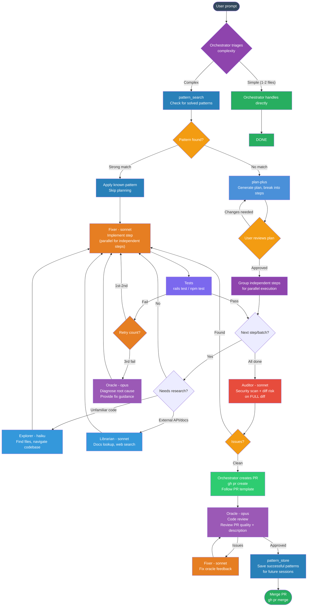

# lean-flow

Lightweight development workflow plugin for Claude Code. Replaces heavy MCP orchestration frameworks with native Claude Code agents + 3-tool pattern memory.

## Why lean-flow?

Frameworks like [ruflo](https://github.com/ruvnet/ruflo) and [oh-my-opencode-slim](https://github.com/ruvnet/oh-my-opencode-slim) register 300+ MCP tools and fire multiple hooks per message, consuming ~3000 tokens/session + ~600 tokens/message in overhead. Most of those tools are never called.

lean-flow extracts the **7 actually useful features** and implements them with native Claude Code capabilities — 3 MCP tools, 3 hooks, 5 agent definitions. Same workflow, 1/60th the token cost.

## Workflow



## What it does

- **Pattern memory** — SQLite + FTS5 full-text search for solved patterns (3 MCP tools vs 300+)
- **Parallel agents** — Oracle (review), Fixer (implement), Explorer (navigate), Librarian (research), Designer (UI)
- **Session briefing** — Git state summary on session start
- **Auto-dream** — Background memory consolidation every 5 sessions / 24 hours
- **PR review hook** — Auto-reminds to dispatch oracle review after `gh pr create`
- **Standard workflow** — plan-plus → parallel fixers → audit → oracle review → merge

## Install

### 1. Add the plugin marketplace to your settings.json

Add this to `~/.claude/settings.json` under `extraKnownMarketplaces`:

```json
{
  "extraKnownMarketplaces": {
    "lean-flow": {
      "source": {
        "source": "github",
        "repo": "helmiatwork/lean-flow"
      }
    }
  },
  "enabledPlugins": {
    "lean-flow@lean-flow": true
  }
}
```

### 2. Permissions and safety hooks (auto-configured)

On first session, the plugin automatically:
- **Allows** workflow tools: `Agent`, `TaskCreate/Update`, `EnterPlanMode/ExitPlanMode`, `SendMessage`, `TeamCreate`, `mcp__knowledge__*`, `mcp__playwright__*`
- **Blocks** protected branch pushes: `main`, `master`, `staging`
- **Blocks** `--no-verify` on git commands

This means the full workflow runs end-to-end without permission prompts, except for protected branch pushes.

### 3. Knowledge MCP server (auto-installed)

The knowledge MCP server (SQLite + FTS5, 3 tools) is **automatically installed on first session start**. The plugin:
1. Copies the MCP server to `~/.claude/mcp-servers/knowledge/`
2. Runs `npm install` for dependencies
3. Registers it with `claude mcp add knowledge`
4. Creates the database at `~/.claude/knowledge/patterns.db`

No manual setup needed. You'll see a confirmation message on first session.

### 3. (Recommended) Also install plan-plus

Add to `extraKnownMarketplaces` in settings.json:

```json
{
  "plan-plus": {
    "source": {
      "source": "github",
      "repo": "RandyHaylor/plan-plus"
    }
  }
}
```

And enable: `"plan-plus@plan-plus": true` under `enabledPlugins`.

## Development flow

```
User prompt
  → Triage (simple → direct, complex → pattern search)
  → pattern_search (found → apply, not found → plan-plus)
  → plan-plus (generate plan → user approves)
  → Parallel fixers (implement steps in batches)
  → Tests (pass → next batch, 3 fails → oracle diagnosis)
  → Audit (security scan on full diff)
  → PR (create → oracle review → merge)
  → pattern_store (save for future sessions)
  → Auto-dream (consolidate memory on session end)
```

## Agents

| Agent | Model | Role |
|-------|-------|------|
| **oracle** | opus | Code review, architecture, stuck diagnosis |
| **fixer** | sonnet | Implementation, bug fixes, tests |
| **librarian** | sonnet | Docs lookup, web search, research |
| **designer** | sonnet | UI/UX, frontend components |
| **explorer** | haiku | File discovery, codebase navigation |

## Knowledge MCP (3 tools)

| Tool | Purpose |
|------|---------|
| `pattern_search` | Search solved patterns before re-solving |
| `pattern_store` | Save problem/solution pairs after success |
| `project_context` | Get/set project summary (tech stack, conventions) |

Data stored in `~/.claude/knowledge/patterns.db` (SQLite + FTS5).

## Token savings vs ruflo/claude-flow

| | ruflo | lean-flow |
|---|---|---|
| MCP tools registered | 300+ | 3 |
| Tokens/session overhead | ~3000 | ~100 |
| Tokens/message overhead | ~600 | ~50 |
| Hooks firing per prompt | 5-8 | 1 |

## Inspired by

- [ruflo](https://github.com/ruvnet/ruflo) — Enterprise AI agent orchestration (300+ tools)
- [oh-my-opencode-slim](https://github.com/ruvnet/oh-my-opencode-slim) — OpenCode/Claude Code enhancement framework
- [plan-plus](https://github.com/RandyHaylor/plan-plus) — Plan mode optimizer (recommended companion plugin)

lean-flow takes the useful patterns from these projects and reimplements them as a lightweight Claude Code plugin.

## License

MIT
