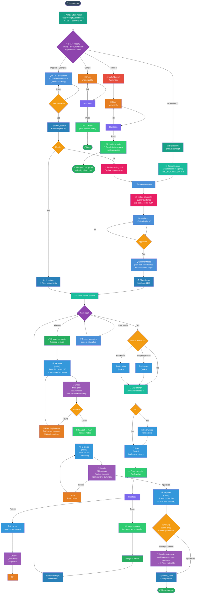

<div align="center">

# lean-flow

**Lightweight dev workflow plugin for Claude Code**

*Same workflow as ruflo/claude-flow. 6 tools instead of 300+. 1/60th the token cost.*

[](LICENSE)
[](https://claude.ai/claude-code)
[](https://github.com/helmiatwork/lean-flow/pulls)

</div>

---

## Why lean-flow?

Frameworks like [ruflo](https://github.com/ruvnet/ruflo) and [oh-my-opencode-slim](https://github.com/ruvnet/oh-my-opencode-slim) register **300+ MCP tools** and fire multiple hooks per message. Most tools are never called, but they still consume **~3000 tokens/session** just by existing.

lean-flow extracts the **7 actually useful features** and implements them with native Claude Code capabilities.

| | ruflo | lean-flow |
|:---|:---:|:---:|
| MCP tools registered | 300+ | **6** |
| Tokens/session overhead | ~3,000 | **~100** |
| Tokens/message overhead | ~600 | **~50** |
| Hooks per prompt | 5-8 | **1** |
| Pattern memory | JSON files | **SQLite + FTS5** |
| Agent orchestration | Custom swarm | **Native Agent tool** |

---

## Features

### 🧠 Pattern Memory
SQLite database with FTS5 full-text search. Save solved patterns, retrieve them before re-solving.

Progressive disclosure — `pattern_search` returns a compact index (~50 tokens), `pattern_get` fetches full solution only when needed (~10x token savings vs returning everything upfront).

| Tool | Purpose |
|:-----|:--------|
| `pattern_search` | Find patterns by keyword — returns compact index (id, key, category, preview) |
| `pattern_get` | Fetch full solution + context for a pattern by ID |
| `pattern_store` | Save problem + solution pairs after success |
| `pattern_list` | List all patterns for a project |
| `pattern_delete` | Remove stale or incorrect patterns |
| `pattern_stats` | Show usage statistics across all projects |
| `project_context` | Store/retrieve project summary & conventions |

### 🤖 Parallel Agents

| Agent | Model | Reads? | Writes? | Role |
|:------|:-----:|:------:|:-------:|:-----|
| **Oracle** | Sonnet | **No** | **No** | Think-only: architecture/security review, synthesis, decisions — **owns the Definition of Done verdict** on PR review |
| **Code Reviewer** | Sonnet | Yes | **No** | Code-quality, SOLID, patterns, and coverage review — read-only |
| **Fixer** | Haiku | Yes | Yes | All implementation: features, bug fixes, refactors, tests, mechanical changes |
| **Librarian** | Haiku | Yes | No | Docs lookup, web search, research |
| **Designer** | Sonnet | Yes | Yes | UI/UX, frontend components |
| **Explorer** | Haiku | Yes | No | File discovery, codebase navigation, codebase map scanning, pre-oracle diff reading |

> **Oracle is think-only.** It never reads files or writes code. Explorer reads files/diffs → orchestrator passes summaries → Oracle thinks and decides. This keeps expensive sonnet tokens minimal.

### 🌿 Branch Naming Convention

| Prefix | Use |
|:-------|:----|
| `feature/` | New functionality |
| `fix/` | Bug fixes |
| `improvement/` | Refactors, performance |
| `security/` | Security patches |
| `test/` | Test-only changes |
| `docs/` | Documentation |
| `chore/` | Dependencies, CI, config |
| `hotfix/` | Urgent production fixes |
| `release/` | Release prep, version bumps |
| `experiment/` | Spikes, prototypes (may discard) |
| `revert/` | Reverting a bad merge |

Steps append `/step-N`: `feature/onboarding/step-1`

### 🔒 Safety Hooks
- **Block** direct push to `main` / `master` / `staging`
- **Ask** before merging any PR to `main` / `master` / `staging` — the review gate (Rule #14) is keyed to the destination, not the task tier, so a "simple" change still stops for confirmation
- **Block** `--no-verify` and `--no-gpg-sign` flags on git commands
- **Block** staging secret files (`.env`, credentials) — warns on `git add .`
- **Block** Claude identity in commits and PRs (Co-Authored-By, attribution)
- **Block** saving plans to wrong directory (`docs/superpowers/plans/`)
- **Auto-allow** workflow tools (Agent, Tasks, PlanMode) — no permission prompts
- **File Read Gate** — before reading any file, injects recent git activity (`git log -3`) as context (~20 tokens, zero AI cost)

> These hooks enforce rules at the shell level (exit code 2 = block). Zero token cost — no prompt instructions needed.

### 🪝 Workflow Hook (`workflow-hook.sh`)

All workflow-related hooks are consolidated into a **single entry point**: `workflow-hook.sh`. It routes by event and matcher internally, and merges multiple `additionalContext` outputs before emitting.

| Event | Trigger | What it does |
|:------|:--------|:-------------|
| `SessionStart` | Session opens | **session-briefing**: git state summary (branch, status, recent commits) |
| `UserPromptSubmit` | Every prompt | **pattern-recall**: searches knowledge MCP for matching patterns before re-solving |
| | | **load-workflow**: injects `claude-rules.md` + full workflow into model context (once per session) |
| | | **star-clarify**: detects vague requests and asks clarifying questions before work starts |
| `PostToolUse Write\|Edit` | After any file write | **enforce-tdd**: injects mandatory RED→GREEN→REFACTOR + E2E + coverage ≥80% + oracle escalation after 3 failures |
| `PostToolUse EnterPlanMode` | On entering plan mode | **knowledge-prefilter**: checks knowledge MCP for relevant patterns, injects into plan context |
| `PostToolUse ExitPlanMode` | On exiting plan mode | **generate-plan-viewer**: opens live plan dashboard at `localhost:3456` |
| `PostToolUse Bash` | After `gh pr create` | **PR notify**: dispatches `lean-flow:code-reviewer` + `lean-flow:fixer` to review and fix the new PR |
| `SubagentStop` | After each subagent | **remind-check-step**: reminds to mark the step `[x]` in the plan skeleton |
| `Stop` | Session ends | **auto-dream** (bg): memory consolidation via Haiku |
| | | **auto-observe** (bg): records session observations to memory |
| | | **session-summary** (bg): writes session summary to `.lean-flow/sessions/` |
| `PostCompact` | After context compaction | **session-summary** (bg): checkpoint summary for continuity |

> **Not consolidated** (kept separate): `ensure-*`, `block-*`, `claude-session-track`, `restructure-plan.py`, `auto-compress-output`, `track-test-failures`, `auto-update-codemaps`, `file-read-gate`

### 📊 Claude Usage Monitoring (Optional)

For real-time Claude AI usage tracking, install [Claude Usage Tracker](https://github.com/hamed-elfayome/Claude-Usage-Tracker) — a native macOS menu bar app:

```bash
brew tap hamed-elfayome/claude-usage
brew install --cask claude-usage-tracker
```

Then click the menu bar icon to authenticate and configure refresh intervals.

> macOS 14.0 (Sonoma)+. Authentication via Claude Code CLI (auto-detected), browser sign-in, or manual session key. See the project's README for details.

### 🗺️ Cartographer (Hybrid Codebase Mapping)
Two-tier documentation system for codebases of any size.

**Tier 1: `docs/CODEBASE_MAP.md`** — high-level architecture atlas
- Mermaid diagrams, directory map, navigation guide
- Generated by parallel Sonnet subagents via `/cartographer`
- Updated rarely (major structural changes only)

**Tier 2: Per-folder `codemap.md`** — module-level detail
- Responsibility, design, flow, integration per directory
- MD5 change detection via `cartographer.py` (`.slim/cartography.json`)
- Updated incrementally after each PR merge (only affected folders)

**Tools:**
- **`/cartographer`** — full mapping (both tiers)
- `cartographer.py init/changes/update` — Tier 2 change detection
- `scan-codebase.py` — token counting for Tier 1 subagent budgeting
- Auto-detects changes on session start (both tiers)

> Tier 1 based on [kingbootoshi/cartographer](https://github.com/kingbootoshi/cartographer). Requires `python3` or `uv`.

### 🎭 E2E Testing
Auto-installs [Playwright MCP](https://github.com/anthropics/anthropic-quickstarts/tree/main/mcp-playwright) for browser automation testing.

### 🎯 Skills (via superpowers plugin)

lean-flow auto-enables the [superpowers](https://github.com/anthropics/claude-code-plugins) plugin which provides these skills used in the workflow:

| Skill | When it's used |
|:------|:---------------|
| `cartographer` | Hybrid codebase mapping — Tier 1: `docs/CODEBASE_MAP.md` (atlas) + Tier 2: per-folder `codemap.md` (detail) |
| `brainstorming` | Before any creative/feature work — explores intent and design |
| `writing-plans` | When creating implementation plans (feeds into plan-plus) |
| `test-driven-development` | Before writing implementation code |
| `systematic-debugging` | When encountering bugs or test failures |
| `verification-before-completion` | Before claiming work is done or creating PRs |
| `receiving-code-review` | When processing oracle's review feedback |
| `finishing-a-development-branch` | When implementation is complete, deciding merge/PR/cleanup |
| `using-git-worktrees` | When feature work needs isolation from main workspace |

**Imported from claude-mem:**

| Skill | When it's used |
|:------|:---------------|
| `babysit` | Watch a pull request or review cycle until it is ready to merge |
| `pathfinder` | Map codebase into feature-grouped flowcharts, identify duplicated concerns, propose unified architecture |
| `learn-codebase` | Prime a codebase by reading every source file in full |

> Skills are invoked automatically when their context matches. No manual activation needed.

### 🔍 Slash Commands

#### Reference Commands
- **`/lean-flow:agents`** — List all subagents with model, role, dispatch criteria, and tools
- **`/lean-flow:workflow`** — Display standard development flow (STAR routing, tier paths, hard rules)
- **`/lean-flow:pattern-search`** — Search knowledge MCP patterns with compact preview; view full or store new

#### Cartography & Mapping
- **`/lean-flow:generate-codemap`** — Tier 1 full codebase map refresh (cartographer script, user confirm, atomic commit)
- **`/lean-flow:update-codemap`** — Tier 2 incremental codemap updates for changed folders (haiku explorer, cheap)

#### Quality & Testing
- **`/lean-flow:lint`** — Run language-specific linters (shellcheck, pyflakes, eslint, rubocop); non-blocking audit
- **`/lean-flow:test`** — Execute test suite and report pass/fail summary with failure details

#### Workflow & Reviews
- **`/lean-flow:status`** — Composite project health dashboard (AI-readiness score, branch, recent commits, open PRs)
- **`/lean-flow:review`** — Trigger code-reviewer + oracle in parallel on branch or specific PR
- **`/lean-flow:sync-checklist`** — Manual plan checklist marking (user-driven explicit per-step confirmation)

#### Legacy Commands
- **`/project-doctor`** — read-only audit of project context artefacts (25 scored + 2 advisory items). Use to diagnose AI-readiness gaps.
- **`/project-doctor-fix`** — single-shot generation of all missing artefacts via 4W1H clusters + lean-flow:fixer dispatch.

### 📺 Live Plan Viewer
Auto-opens a browser dashboard at `localhost:3456` when you exit plan mode. Shows all plans grouped by repo with real-time updates.

- **Two-panel layout** — sidebar with repos + plans, main panel with step details
- **Live reload** — file watcher + Server-Sent Events, updates instantly when steps are checked off
- **Sorted** — incomplete plans on top (lowest progress first), completed at bottom
- **20 per repo** — "Show more" button for older plans
- **Status indicators** — 🟢 complete, 🟡 in progress, ⚫ not started

The viewer runs as a background server. Starts automatically on first plan exit, reuses existing server on subsequent exits.

### ⚡ RTK (Rust Token Killer)
Auto-installs [RTK](https://www.rtk-ai.app) — a Rust CLI proxy that rewrites Bash commands to token-optimized equivalents. Typical savings: **40-90% fewer output tokens** on dev operations.

- `git status`, `ls`, `find`, `grep`, `diff` → compact RTK output
- Transparent — no prompt changes needed, works via PreToolUse hook
- Check savings anytime: `rtk gain`

> RTK is auto-installed on first session (via brew or curl fallback). Disable with `"enable": { "rtk": false }` in `~/.claude/lean-flow.json`.

### 💤 Auto-Dream
Background memory consolidation using Haiku. Runs every 5 sessions / 24 hours. Cleans up stale memories, merges duplicates, prunes outdated entries.

---

## Workflow


```mermaid
flowchart TD
    USER(["👤 User prompt"]) --> AUTORECALL

    AUTORECALL["⚡ Auto pattern recall\nUserPromptSubmit hook\nFTS5 → patterns.db"] --> STAR

    STAR{"⭐ STAR classify\nsimple / medium / heavy\n+ greenfield / hotfix"}
    STAR -->|"Simple"| DIRECTFIX
    STAR -->|"Medium / Complex"| STARSHOW
    STAR -->|"Greenfield 🌱"| GREENFIELD
    STAR -->|"Hotfix 🔥"| HOTFIX

    %% === STAR CONFIRM (medium / heavy only) ===
    STARSHOW["📋 STAR breakdown\nS·T·A·R shown to user\n(medium / heavy)"] --> STARCONFIRM
    STARCONFIRM{"User confirms?"}
    STARCONFIRM -->|"Adjust"| STARSHOW
    STARCONFIRM -->|"Yes"| MEMORY

    %% === GREENFIELD PATH ===
    GREENFIELD["🌱 Brainstorm\nproduct concept"] --> GENDOCS
    GENDOCS["📄 Generate docs\n(parallel sonnet agents)\nPRD, HLA, TRD, DB, API"] --> PLANMODE

    %% === SIMPLE PATH ===
    DIRECTFIX["🔧 Fixer\nImplement fix"] --> DIRECTTEST["Run tests"]
    DIRECTTEST -->|"Pass"| DIRECTPR["PR → main\n(with release notes)"]
    DIRECTTEST -->|"Fail"| DIRECTFIX
    DIRECTPR --> DONE(["✅ Done"])

    %% === HOTFIX PATH ===
    HOTFIX["🔥 hotfix/ branch\nfrom main"] --> HOTFIXFIXER["🔧 Fixer\nMinimal fix"]
    HOTFIXFIXER --> HOTFIXTEST["Run tests"]
    HOTFIXTEST -->|"Fail"| HOTFIXFIXER
    HOTFIXTEST -->|"Pass"| HOTFIXPR["PR hotfix → main\n🔮 Oracle inline review\n+ release notes"]
    HOTFIXPR --> HOTFIXMERGE(["✅ Merge + cherry-pick\nto in-flight branches"])

    %% === COMPLEX PATH ===
    MEMORY["🧠 pattern_search\nKnowledge MCP"] --> FOUND

    FOUND{"Match?"}
    FOUND -->|"Yes"| ADAPT["Apply pattern\n🔧 Fixer implements"]
    FOUND -->|"No"| BRAINSTORM

    BRAINSTORM["💡 Brainstorming skill\nExplore requirements"] --> PLANMODE

    PLANMODE["📋 EnterPlanMode"] --> QUALITY

    QUALITY["✍️ writing-plans skill\nQuality guidance\n(file paths, code, TDD)"] --> WRITE

    WRITE["Write plan to\n~/.claude/plans/"] --> REVIEW

    REVIEW{"Approved?"}
    REVIEW -->|"No"| WRITE
    REVIEW -->|"Yes"| EXITPLAN

    EXITPLAN["📋 ExitPlanMode\nplan-plus restructures\ninto skeleton + steps"] --> VIEWER

    VIEWER["📺 Plan viewer\nlocalhost:3456"] --> BRANCH

    ADAPT --> BRANCH

    BRANCH["🌿 Create parent branch"] --> STEP

    STEP{"Next step?"}
    STEP -->|"Yes"| RESEARCH
    STEP -->|"All done"| PLANCOMPLETE["✅ All steps complete!\nProceed to audit"]
    PLANCOMPLETE --> AUDITSCAN
    STEP -->|"Plan invalid"| REPLAN

    REPLAN["📋 Revise remaining\nsteps in plan-plus"] --> STEP

    RESEARCH{"Needs research?"}
    RESEARCH -->|"Unfamiliar code"| EXPLORER["🔍 Explorer\n(haiku)"]
    RESEARCH -->|"Need docs"| LIBRARIAN["📚 Librarian\n(haiku)"]
    RESEARCH -->|"No"| STEPBR

    EXPLORER --> STEPBR
    LIBRARIAN --> STEPBR

    STEPBR["🌿 Step branch\nprefix/name/step-N"] --> TESTFIRST

    TESTFIRST{"TDD?"}
    TESTFIRST -->|"Yes"| TDDTEST["🔧 Fixer writes\nfailing tests"] --> IMPLEMENT
    TESTFIRST -->|"No"| IMPLEMENT

    IMPLEMENT["🔧 Fixer\n(haiku)\nImplement + tests"] --> FIXCHECK

    FIXCHECK["✅ Fixer checklist\n(self-verify)"] --> TEST

    TEST["Run tests"]
    TEST -->|"Fail x3"| ORACLE_SCAN["🔍 Explorer\nreads error context"] --> ORACLE_ESC["🔮 Oracle\n(think-only)\nDiagnosis"]
    ORACLE_ESC --> FIX
    TEST -->|"Pass"| STEPPR

    STEPPR["PR step → parent\n(auto-merge, no oracle)"] --> MERGE_STEP["Merge to parent"]
    MERGE_STEP --> CHECKBOX["☑️ Mark step [x]\nin skeleton"]
    CHECKBOX --> STEP

    AUDITSCAN["🔍 Explorer\n(haiku)\nRead full parent diff\n→ structured summary"] --> AUDIT

    AUDIT["🔮 Oracle\n(think-only)\nSecurity audit\nfrom explorer summary"] --> CLEAN

    CLEAN{"Issues?"}
    CLEAN -->|"Found"| FIXAUDIT["🔧 Fixer implements\n🔍 Explorer re-reads\n🔮 Oracle reviews"]
    CLEAN -->|"Clean"| MAINPR

    FIXAUDIT --> AUDITSCAN

    MAINPR["PR parent → main\n+ release notes"] --> FINALSCAN

    FINALSCAN["🔍 Explorer\n(haiku)\nScan PR diff\n→ summary"] --> FINAL

    FINAL["🔮 Oracle\n(think-only)\nReview checklist\nfrom explorer summary"]
    FINAL -->|"Issues"| FIXFINAL["🔧 Fixer\nfix on parent"]
    FINAL -->|"Approved"| CMAPSCAN

    FIXFINAL --> FINALSCAN

    CMAPSCAN["🔍 Explorer\n(haiku)\nScan touched dirs\n→ structure summary"] --> CODEMAP

    CODEMAP{"🔮 Oracle\n(think-only)\nCodemap decision"}
    CODEMAP -->|"Missing/outdated"| CMAPSYNTH["🔮 Oracle synthesizes\ncodebase map from summary\n→ 🔧 Fixer writes file"]
    CODEMAP -->|"Up to date"| LEARN
    CMAPSYNTH --> LEARN

    LEARN["🧠 pattern_store\nSave patterns"] --> MERGE_MAIN(["✅ Merge to main"])

    style USER fill:#34495E,color:#fff
    style AUTORECALL fill:#16A085,color:#fff
    style STAR fill:#8E44AD,color:#fff
    style STARSHOW fill:#4A90D9,color:#fff
    style STARCONFIRM fill:#F39C12,color:#fff
    style MEMORY fill:#2980B9,color:#fff
    style FOUND fill:#F39C12,color:#fff
    style ADAPT fill:#2980B9,color:#fff
    style BRAINSTORM fill:#E91E63,color:#fff
    style DIRECTFIX fill:#E67E22,color:#fff
    style DIRECTTEST fill:#7B68EE,color:#fff
    style DIRECTPR fill:#2ECC71,color:#fff
    style REVIEW fill:#F39C12,color:#fff
    style PLANMODE fill:#4A90D9,color:#fff
    style QUALITY fill:#E91E63,color:#fff
    style WRITE fill:#4A90D9,color:#fff
    style EXITPLAN fill:#4A90D9,color:#fff
    style VIEWER fill:#2980B9,color:#fff
    style BRANCH fill:#1ABC9C,color:#fff
    style STEP fill:#8E44AD,color:#fff
    style REPLAN fill:#4A90D9,color:#fff
    style STEPBR fill:#1ABC9C,color:#fff
    style TESTFIRST fill:#F39C12,color:#fff
    style IMPLEMENT fill:#3498DB,color:#fff
    style FIXCHECK fill:#2ECC71,color:#fff
    style FIX fill:#E67E22,color:#fff
    style FIXAUDIT fill:#E67E22,color:#fff
    style FIXFINAL fill:#E67E22,color:#fff
    style TEST fill:#7B68EE,color:#fff
    style TDDTEST fill:#3498DB,color:#fff
    style AUDIT fill:#9B59B6,color:#fff
    style AUDITSCAN fill:#3498DB,color:#fff
    style FINALSCAN fill:#3498DB,color:#fff
    style CMAPSCAN fill:#3498DB,color:#fff
    style CMAPSYNTH fill:#9B59B6,color:#fff
    style ORACLE_SCAN fill:#3498DB,color:#fff
    style MAINPR fill:#2ECC71,color:#fff
    style RESEARCH fill:#F39C12,color:#fff
    style EXPLORER fill:#3498DB,color:#fff
    style LIBRARIAN fill:#3498DB,color:#fff
    style ORACLE_ESC fill:#9B59B6,color:#fff
    style FINAL fill:#9B59B6,color:#fff
    style STEPPR fill:#2ECC71,color:#fff
    style MERGE_STEP fill:#27AE60,color:#fff
    style CHECKBOX fill:#2980B9,color:#fff
    style PLANCOMPLETE fill:#27AE60,color:#fff
    style CODEMAP fill:#F39C12,color:#fff
    style LEARN fill:#2980B9,color:#fff
    style MERGE_MAIN fill:#27AE60,color:#fff
    style DONE fill:#27AE60,color:#fff
    style CLEAN fill:#F39C12,color:#fff
    style HOTFIX fill:#E74C3C,color:#fff
    style HOTFIXFIXER fill:#E67E22,color:#fff
    style HOTFIXTEST fill:#7B68EE,color:#fff
    style HOTFIXPR fill:#2ECC71,color:#fff
    style HOTFIXMERGE fill:#27AE60,color:#fff
    style GREENFIELD fill:#16A085,color:#fff
    style GENDOCS fill:#1ABC9C,color:#fff
```

<details>
<summary><strong>Workflow steps explained (18 steps)</strong></summary>

1. **Triage** — Simple → fixer + test + PR. Complex → pattern search. Greenfield → doc-first. Hotfix → fast path.
2. **Pattern Search** — Check knowledge MCP. Match → fixer applies. No match → brainstorm.
3. **Brainstorming** — Explore requirements and design before planning.
3a. **Greenfield: Doc-First** — For new projects: brainstorm → generate docs (PRD, HLA, TRD, DB, API) → plan from docs.
4. **Planning** — plan-plus generates skeleton + step files. User approves.
5. **Branching** — Parent branch from main. Step branches from parent (skip step branches when solo).
6. **Execute Steps** — TDD optional. Fixer implements + writes tests. Parallel independent steps.
6a. **Solo Dev** — Skip step PRs. Commit on parent. Use plan-plus-executor agents per step.
7. **Re-planning** — If a step reveals plan is wrong, revise remaining steps.
8. **Agent Routing** — Explorer/Fixer/Librarian (haiku), Oracle/Designer (sonnet). Oracle is think-only (no file access).
9. **Test + Retry** — 3 failures → explorer reads context → oracle diagnoses. 3 oracle rounds → human intervention.
10. **Security Audit** — Explorer reads full parent diff → Oracle audits from summary. Fixer fixes, explorer re-reads, oracle reviews. Max 3 rounds.
11. **Commit & PR Style** — Two templates: step PR (technical) vs main PR (business + release notes).
12. **Final PR** — Parent → main with release notes. Explorer scans diff → Oracle final review.
12a. **Codebase Map Maintenance** — After approval, Explorer scans touched dirs → Oracle decides → Oracle synthesizes codebase map update → Fixer writes file.
13. **Hotfix** 🔥 — Branch from main, skip planning, inline oracle review, fast merge.
14. **Post-Merge** — Monitor. Rollback via hotfix path if broken.
15. **Learn** — Save patterns for future sessions.
16. **Auto-Dream** — Background memory consolidation.

</details>

---

## Quick Start

### 1. Enable the plugin

Add to `~/.claude/settings.json`:

```json
{
  "extraKnownMarketplaces": {
    "helmiatwork": {
      "source": {
        "source": "github",
        "repo": "helmiatwork/lean-flow"
      }
    }
  },
  "enabledPlugins": {
    "lean-flow@helmiatwork": true
  }
}
```

### 2. Start a session

Everything else is **automatic**. On first session, lean-flow will:

| Step | What gets installed | Time |
|:-----|:-------------------|:----:|
| 🧠 Knowledge MCP | SQLite + FTS5 pattern memory (6 tools) | ~10s |
| 🔌 Companion Plugins | superpowers + caveman + plan-plus (auto-enabled) | ~1s |
| ⚠️ Writing-Plans | Disables superpowers writing-plans skill (conflicts with plan-plus) | ~1s |
| 🔒 Permissions | Auto-allow workflow tools, block protected branches | ~1s |
| 🎭 Playwright | `@playwright/mcp` + Chromium browser | ~30s |
| 📊 Usage Monitor | SwiftBar + launchd fetcher *(macOS only)* | ~15s |
| ⚡ RTK | Rust tool rewrites for faster Bash commands ([rtk-ai.app](https://www.rtk-ai.app)) | ~5s |
| 🗺️ Cartographer | Detect codebase map changes via git, prompt updates | ~2s |
| 📺 Plan Viewer | Live dashboard at localhost:3456 (on ExitPlanMode) | ~1s |
| 📋 Session Briefing | Git state summary | ~1s |

> **Subsequent sessions:** All checks run but skip in <100ms total (idempotent).

### 3. Companion plugins (auto-configured)

lean-flow automatically enables these companion plugins on first session:

| Plugin | Source | Purpose |
|:-------|:-------|:--------|
| **superpowers** | [claude-plugins-official](https://github.com/anthropics/claude-code-plugins) | Skills & workflows (brainstorming, TDD, debugging, etc.) |
| **caveman** | [JuliusBrussee/caveman](https://github.com/JuliusBrussee/caveman) | Token-compressed communication mode |
| **plan-plus** | [RandyHaylor/plan-plus](https://github.com/RandyHaylor/plan-plus) | Structured planning with skeleton + step files |

**To disable caveman auto-enable**, set `LEAN_FLOW_ENABLE_CAVEMAN=false` in your shell environment, or set `enabledPlugins."caveman@caveman" = false` in `~/.claude/settings.json` (lean-flow respects user-set values).

> **Important:** lean-flow uses **plan-plus** for planning. The flow is:
> 1. `EnterPlanMode` — opens plan file at `~/.claude/plans/`
> 2. Invoke `writing-plans` skill for quality guidance (how to write good plans)
> 3. Write the plan to the plan mode file (wrong directory blocked by hook)
> 4. `ExitPlanMode` — plan-plus restructures into skeleton + steps, plan viewer opens

> Restart session after first install to activate.

## Onboarding for New Projects

Once lean-flow is enabled, auditing + bootstrapping any project is one command:

```bash
/project-doctor              # read-only: audit project AI-readiness (25 items)
/project-doctor-fix          # auto-generate all missing artefacts in one pass
```

The audit checks for:
- **CLAUDE.md** — project conventions, tech stack, branch rules.
- **docs/CODEBASE_MAP.md** — architecture atlas.
- **docs/ARCHITECTURE.md** — system design.
- **docs/DOMAIN.md** — entity relationships.
- **per-folder codemap.md** — module-level detail.
- **Hooks** — `.claude/settings.json`, `.claude/hooks/session-start.sh`.
- **ADRs** — `docs/adr/` architecture decisions.
- **CI/CD** — `.github/workflows/`, coverage gates.
- **Pre-commit gates** — `lefthook.yml`, `.pre-commit-config.yaml`.

If items are missing, `/project-doctor-fix` generates them automatically:
1. Asks 4W1H questions per cluster.
2. Dispatches `lean-flow:fixer` to write each file atomically.
3. Commits + pushes the bootstrap branch.
4. Opens a PR (no reviews needed for greenfield bootstrap).

**Result:** Your project gains immediate AI-readiness: clear conventions, documented architecture, test hooks, and orchestrator binding.

---

## Bundled Commands

The following slash commands are bundled with lean-flow:

- **`/project-doctor`** — read-only audit of project context artefacts (CLAUDE.md, codemap, architecture, ERD, ADR, hooks, etc.). Reports AI-readiness score (0–100%) and lists missing items. Does NOT modify files.
- **`/project-doctor-fix`** — auto-generate all missing project context artefacts in one pass. Runs the audit, asks 4W1H questions per cluster, dispatches `lean-flow:fixer` to write every missing file atomically.

---

## Uninstall

To completely remove lean-flow and all installed components:

```bash
bash /path/to/lean-flow/plugin/scripts/uninstall.sh
```

Or if installed as a plugin:
```bash
bash ~/.claude/plugins/cache/lean-flow/*/plugin/scripts/uninstall.sh
```

This removes: knowledge MCP, Playwright MCP, SwiftBar monitor, launchd daemon, dream state, and config file. Pattern database deletion requires confirmation.

---

## Configuration

Customize lean-flow by creating `~/.claude/lean-flow.json`:

```json
{
  "protectedBranches": ["main", "master", "staging", "production"],
  "models": {
    "fixer": "sonnet",
    "oracle": "opus",
    "explorer": "haiku"
  },
  "dream": {
    "sessions": 5,
    "hours": 24
  },
  "enable": {
    "playwright": true,
    "monitor": true,
    "knowledge": true,
    "rtk": true
  },
  "branchPrefixes": ["feature", "fix", "improvement", "security", "test", "docs", "chore", "hotfix"]
}
```

All fields are optional — defaults are used for any missing field.

---

## Team Usage & CI/CD

**Sharing patterns across a team:**
- Export: `sqlite3 ~/.claude/knowledge/patterns.db ".dump patterns" > patterns.sql`
- Import: `sqlite3 ~/.claude/knowledge/patterns.db < patterns.sql`

**Monorepos:** Use distinct `project` names per service when calling `pattern_store`.

**CI/CD:** lean-flow is designed for interactive Claude Code sessions. For CI, use the workflow doc (`workflows/standard-development-flow.md`) as reference for your pipeline stages.

---

## What's Inside

```
lean-flow/
├── .claude-plugin/
│   └── plugin.json              # Plugin metadata
├── agents/
│   ├── oracle.md                # Sonnet — think-only: review, architecture, security (no file access)
│   ├── fixer.md                 # Haiku — all implementation, tests, mechanical changes
│   ├── librarian.md             # Haiku — research, docs
│   ├── designer.md              # Sonnet — UI/UX
│   └── explorer.md              # Haiku — codebase navigation, codebase map scanning, pre-oracle reads
├── commands/
│   ├── project-doctor.md        # /project-doctor — read-only audit (25 scored + 2 advisory)
│   └── project-doctor-fix.md    # /project-doctor-fix — single-shot generation
├── skills/
│   ├── cartography.md           # Codebase mapping skill (cartographer)
│   ├── project-doctor.md        # Project-doctor audit skill
│   └── project-doctor-fix.md    # Project-doctor fix generation skill
├── hooks/
│   └── hooks.json               # SessionStart, PreToolUse, PostToolUse, Stop
├── plugin/scripts/
│   │
│   │   # — Registered hooks (run directly by hooks.json) —
│   ├── workflow-hook.sh         # Single entry point for workflow events (routes internally)
│   ├── ensure-knowledge-mcp.sh  # SessionStart: auto-install SQLite pattern memory
│   ├── ensure-plugins.sh        # SessionStart: auto-enable superpowers + caveman + plan-plus
│   ├── ensure-permissions.sh    # SessionStart: auto-configure workflow permissions
│   ├── ensure-playwright-mcp.sh # SessionStart: auto-install Playwright + Chromium
│   ├── ensure-claude-monitor.sh # SessionStart: auto-install SwiftBar usage monitor
│   ├── ensure-plan-viewer.sh    # SessionStart: auto-start plan viewer server
│   ├── ensure-rtk.sh            # SessionStart: auto-install RTK
│   ├── ensure-cartography.sh    # SessionStart: detect codebase map changes
│   ├── bash-guard.sh            # PreToolUse Bash: unified guard (protected-push, no-verify, secrets, Claude identity, PR comments, branch-delete)
│   ├── warn-secret-files.sh     # PreToolUse Write|Edit: warn near secret paths
│   ├── block-wrong-plan-dir.sh  # PreToolUse Write|Edit: block plans outside ~/.claude/plans/
│   ├── auto-compress-output.sh  # PreToolUse Bash: compress high-output commands via Haiku
│   ├── file-read-gate.sh        # PreToolUse Read: inject recent git activity (~20 tokens, zero AI)
│   ├── restructure-plan.py      # PostToolUse ExitPlanMode: plan-plus restructuring
│   ├── track-test-failures.sh   # PostToolUse Bash: count failures, escalate to oracle at 3
│   ├── auto-update-codemaps.sh  # PostToolUse Bash(git commit): update codemaps
│   │
│   │   # — workflow-hook.sh internal handlers (not separate hooks) —
│   ├── session-briefing.sh      # SessionStart: git state summary
│   ├── pattern-recall.sh        # UserPromptSubmit: knowledge MCP pattern search
│   ├── load-workflow.sh         # UserPromptSubmit: inject claude-rules.md (once/session)
│   ├── star-clarify.sh          # UserPromptSubmit: detect vague prompts
│   ├── enforce-tdd.sh           # PostToolUse Write|Edit: mandatory TDD reminder
│   ├── knowledge-prefilter.sh   # PostToolUse EnterPlanMode: inject patterns into plan
│   ├── generate-plan-viewer.sh  # PostToolUse ExitPlanMode: open plan dashboard
│   ├── remind-check-step.sh     # SubagentStop: remind to mark step [x]
│   ├── auto-dream.sh            # Stop: memory consolidation via Haiku (background)
│   ├── auto-observe.sh          # Stop: session observations to memory (background)
│   ├── session-summary.sh       # Stop/PostCompact: write session summary (background)
│   │
│   │   # — Utilities —
│   ├── load-config.sh           # Load ~/.claude/lean-flow.json config
│   ├── token-budget.sh          # Token budget tracking
│   ├── plan-server.mjs          # Live plan viewer server (SSE + file watch)
│   ├── plan-viewer.mjs          # Static HTML generator (fallback)
│   ├── cartographer.py          # Tier 2: MD5 change detection for per-folder codemaps
│   ├── scan-codebase.py         # Tier 1: codebase scanner with token counts
│   ├── uninstall.sh             # Remove all lean-flow components
│   ├── project-doctor/          # Project-doctor audit and fix suite
│   │   └── score.sh             # 20-item AI-readiness scanner
│   └── claude-monitor/          # SwiftBar plugin + fetcher daemon
│       ├── claude-usage.30s.sh  # SwiftBar display script (reads cache, renders menu)
│       ├── claude-usage-fetch.sh # Fetcher daemon (OAuth → usage API + local token stats)
│       ├── local-tokens.py      # Per-model token aggregator from ~/.claude JSONL files
│       └── install.command      # One-click installer for SwiftBar + launchd daemon
├── templates/
│   ├── PULL_REQUEST_TEMPLATE.md      # Step PR (child → parent)
│   ├── PULL_REQUEST_TEMPLATE_MAIN.md # Feature PR (parent → main) + release notes
│   └── COMMIT_CONVENTION.md          # Commit + PR style guide
├── workflows/
│   └── standard-development-flow.md
├── mcp-servers/
│   └── knowledge/               # SQLite + FTS5 MCP server
│       ├── index.mjs
│       └── package.json
├── CHANGELOG.md
├── LICENSE
└── README.md
```

---

## Agent Comparison: lean-flow vs ruflo

| Role | ruflo agent | lean-flow agent | Difference |
|:-----|:-----------|:----------------|:-----------|
| Architecture, review & security | `architect.yaml` + `security-architect.yaml` (tags only) | **oracle.md** (sonnet, think-only) | Full instructions, severity levels, PR review, security audit, PII checks. Never reads files — receives summaries from explorer |
| Implementation & testing | `coder.yaml` + `tester.yaml` (tags only) | **fixer.md** (haiku) | All code changes + test writing in one agent, retry behavior |
| Code review | `reviewer.yaml` (tags only) | **oracle.md** (sonnet) | Same agent handles review + architecture + security (saves sonnet calls) |
| Research | *(none)* | **librarian.md** (haiku) | Docs lookup, web search, API reference |
| UI/UX | *(none)* | **designer.md** (sonnet) | Frontend components, accessibility, responsive design |
| Navigation | *(none)* | **explorer.md** (haiku) | Fast file discovery, codebase structure, codebase map scanning, pre-oracle diff reading |

> ruflo agents are YAML stubs (~5 lines each, no instructions). lean-flow agents are full markdown definitions with role, rules, tools, and behavioral constraints.

---

## Companion Tools (auto-bootstrapped)

On `SessionStart`, lean-flow ensures these tools are installed and wired. Each is **opt-out** via env var (e.g. `LEAN_FLOW_ENABLE_OMNI=false` or `~/.claude/lean-flow.json`).

| Tool | What it does | Bootstrap | Install method |
|---|---|---|---|
| **RTK** | Rewrites Bash commands to faster Rust equivalents | `ensure-rtk.sh` | brew (auto) |
| **OMNI** | Distills Bash output via 36 filters + FTS5 (~93% token savings) | `ensure-omni.sh` | brew (auto) |
| **GitNexus** | Indexes the repo into a queryable knowledge graph (MCP) | `ensure-gitnexus.sh` | npx (registers MCP; index built on-demand via `npx gitnexus analyze`) |
| **Knowledge MCP** | SQLite + FTS5 pattern memory | `ensure-knowledge-mcp.sh` | bundled |
| **Cartography** | Two-tier codebase mapping | `ensure-cartography.sh` | bundled |
| **Plan viewer** | localhost:3456 plan dashboard | `ensure-plan-viewer.sh` | bundled |
| **Playwright MCP** | Browser automation for E2E tests | `ensure-playwright-mcp.sh` | npx |
| **Claude Monitor** | SwiftBar usage menu bar plugin (macOS) | `ensure-claude-monitor.sh` | brew + SwiftBar |

Idempotent — each script detects existing install/registration and silently skips. Failures (e.g. brew unavailable) emit a one-line `systemMessage` and exit 0 — they never block the session.

After the bootstrap chain, `check-dependencies.sh` audits everything and emits a single warning if anything is **missing** (REQUIRED), **misconfigured** (RECOMMENDED), or **deprecated** (e.g. plan-plus still enabled). Cached by finding-set hash so it only warns when the missing set actually changes.

---

## Model Presets

Switch all 3 model env vars at once with `lean-preset.sh`:

```bash
bash plugin/scripts/lean-preset.sh             # show current + available
bash plugin/scripts/lean-preset.sh cheap       # haiku everywhere
bash plugin/scripts/lean-preset.sh balanced    # haiku + sonnet + opus
bash plugin/scripts/lean-preset.sh powerful    # sonnet + sonnet + opus
bash plugin/scripts/lean-preset.sh thinking    # opus everywhere
```

Custom presets at `~/.claude/lean-flow-presets.json`:

```json
{ "myteam": { "haiku": "claude-haiku-4-5-20251001", "sonnet": "claude-sonnet-4-6", "opus": "claude-opus-4-7" } }
```

## Hooks worth knowing

| Hook | Trigger | What it does |
|---|---|---|
| `delegate-task-retry.sh` | PostToolUse Task | When a Task call fails (missing subagent_type, unknown agent, validation error), appends inline retry guidance with a corrected example |
| `todo-hygiene.sh` | Stop + UserPromptSubmit | If you stop with open `[ ]` steps in `~/.claude/plans/`, the next prompt gets a reminder pointing at the unfinished plan |
| `enforce-tdd.sh` | PostToolUse Write/Edit | Reminds about test-driven development on code creation |

## Testing

Run the full suite locally:

```bash
bash tests/run-all.sh
```

Coverage:
- **Bash hooks/scripts** — `tests/shell/` (workflow router, load-workflow, ensure-* scripts, block-* hooks, TDD enforcement, full hook lifecycle)
- **Skill cross-reference linter** — `tests/shell/test-skill-references.sh` catches dangling `*.md` references inside skills/workflows
- **Python** — `tests/python/` (cartographer, scan-codebase)
- **Node** — `tests/node/` (plan-server, plan-viewer)

CI runs the full suite on every push and PR via `.github/workflows/test.yml`.

---

## Inspired By

> lean-flow stands on the shoulders of these projects — taking their best ideas and distilling them into a lightweight plugin.

- **[ruflo](https://github.com/ruvnet/ruflo)** — Enterprise AI agent orchestration with 60+ agent types
- **[oh-my-opencode-slim](https://github.com/ruvnet/oh-my-opencode-slim)** — OpenCode/Claude Code enhancement framework
- **[gsd](https://github.com/davidpp/gsd)** — Get Stuff Done: structured phase-based workflow system for Claude Code
- **[superpowers](https://github.com/anthropics/claude-code-plugins)** — Official Anthropic plugin providing skills (TDD, debugging, brainstorming, code review)
- **[plan-plus](https://github.com/RandyHaylor/plan-plus)** — Plan mode optimizer (recommended companion)
- **[cartographer](https://github.com/kingbootoshi/cartographer)** — Codebase mapping via parallel AI subagents (Tier 1 atlas)
- **[rtk](https://www.rtk-ai.app)** — Rust token killer — transparent CLI proxy that rewrites dev commands for 60–90% token savings
- **[SwiftBar](https://github.com/swiftbar/SwiftBar)** — macOS menu bar scripting platform powering the usage monitor
- **[claude-mem](https://github.com/hestudy/claude-mem)** — Persistent memory system for Claude Code sessions

---

<div align="center">

**MIT License** · Made by [helmiatwork](https://github.com/helmiatwork)

</div>
