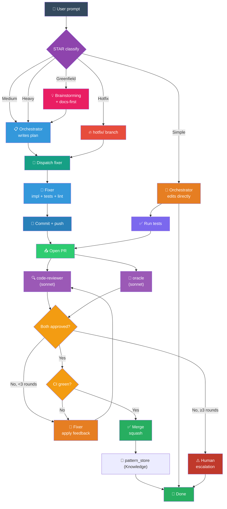

# Architecture

System design and data flow of lean-flow plugin.

## Control Flow Diagram



## Hook Lifecycle

```mermaid
flowchart LR
    START["Session\nstart"] --> SS["SessionStart\nhooks"]
    SS --> PROMPT["👤 User\nprompt"]
    
    PROMPT --> STAR["🎯 STAR\nclassify"]
    STAR --> WORK["🔨 Do work\n(tools or skills)"]
    
    WORK --> PRE{PreToolUse\nmatch?}
    PRE -->|Match| PREBLOCK{Block?}
    PREBLOCK -->|Yes| REJECT["❌ Reject\n(exit 2)"]
    PREBLOCK -->|No| TOOL["🔧 Tool\nexecutes"]
    PRE -->|No match| TOOL
    
    REJECT --> NEXT["Try again"]
    NEXT --> WORK
    
    TOOL --> POST{PostToolUse\nmatch?}
    POST -->|Match| ACTION["📊 Context\ninject/track"]
    POST -->|No match| DONE_T["Ready for\nnext step"]
    ACTION --> DONE_T
    
    DONE_T --> MORE{More\nwork?}
    MORE -->|Yes| WORK
    MORE -->|No| STOP["Session\nends"]
    
    STOP --> STOPK["Stop\nhooks"]
    STOPK --> END["🌙 Cleanup\nconsolidate"]
    
    style START fill:#34495E,color:#fff
    style SS fill:#16A085,color:#fff
    style PROMPT fill:#34495E,color:#fff
    style STAR fill:#8E44AD,color:#fff
    style WORK fill:#3498DB,color:#fff
    style PRE fill:#E67E22,color:#fff
    style PREBLOCK fill:#E67E22,color:#fff
    style REJECT fill:#C0392B,color:#fff
    style NEXT fill:#F39C12,color:#fff
    style TOOL fill:#2980B9,color:#fff
    style POST fill:#E67E22,color:#fff
    style ACTION fill:#3498DB,color:#fff
    style DONE_T fill:#2ECC71,color:#fff
    style MORE fill:#F39C12,color:#fff
    style STOP fill:#34495E,color:#fff
    style STOPK fill:#16A085,color:#fff
    style END fill:#27AE60,color:#fff
```



## Hook Registry (plugin/hooks/hooks.json)

Organized by event type:

| Event | Trigger | Hooks | Purpose |
|-------|---------|-------|---------|
| **SessionStart** | Session opens | ensure-knowledge-mcp, ensure-plugins, ensure-permissions, ensure-playwright, ensure-monitor, ensure-rtk, ensure-cartography, ensure-plan-viewer, workflow-hook (routes internally) | Bootstrap dependencies, session briefing. |
| **PreToolUse Bash** | Before bash execution | bash-guard (unified: protected-push, no-verify, secret-files, claude-identity, branch-delete, pr-comments), workflow-hook (star-clarify if first prompt) | Block unsafe git, security gates. |
| **PreToolUse Write\|Edit** | Before file write | warn-secret-files, block-wrong-plan-dir, workflow-hook (enforce-tdd) | Warn near secrets, TDD reminder. |
| **PreToolUse Read** | Before file read | file-read-gate, workflow-hook (star-clarify) | Inject git context, check vague prompts. |
| **PostToolUse Write\|Edit** | After file write | enforce-tdd, auto-update-codemaps | Remind TDD, update codemaps. |
| **PostToolUse EnterPlanMode** | On plan enter | workflow-hook (knowledge-prefilter) | Inject matching patterns. |
| **PostToolUse ExitPlanMode** | On plan exit | restructure-plan.py, workflow-hook (generate-plan-viewer) | Restructure → skeleton + steps, open dashboard. |
| **PostToolUse Bash (git commit)** | After git commit | auto-update-codemaps, workflow-hook (remind-check-step) | Update per-folder codemaps, remind mark [x]. |
| **PostToolUse Task (subagent)** | After subagent returns | delegate-task-retry (on failure), workflow-hook (remind-check-step) | Retry guidance on task failure. |
| **UserPromptSubmit** | Every prompt | workflow-hook (pattern-recall, load-workflow, star-clarify) | Search patterns, inject context, classify. |
| **Stop** | Session ends | auto-dream, auto-observe, session-summary | Consolidate memory, record observations (bg). |
| **PostCompact** | After context compaction | session-summary | Checkpoint summary. |

**consolidated**: workflow-hook.sh routes internally to session-briefing, pattern-recall, load-workflow, star-clarify, enforce-tdd, knowledge-prefilter, generate-plan-viewer, remind-check-step.

**separate**: ensure-*, block-*, file-read-gate, track-test-failures, auto-update-codemaps, delegate-task-retry, restructure-plan.py.

## Agent Model Assignments

| Agent | Model | Scope | Reasoning |
|-------|-------|-------|-----------|
| **Orchestrator** | Opus | Coordination, classification | Complex meta-reasoning (tier classification, plan approval). |
| **Fixer** | Haiku | Mechanical execution from explicit plan | Plan is detailed + specific code. No reasoning needed. |
| **Oracle** | Sonnet | Architecture, security, PR review (think-only) | Requires judgment but only receives summaries (no file I/O = lower token burn). |
| **Code-reviewer** | Sonnet | Quality, SOLID, patterns, coverage | Judgment-based review. |
| **Designer** | Sonnet | Frontend/UI/UX, a11y, responsive | Aesthetic + interaction judgment. |
| **Explorer** | Haiku | File discovery, codebase scan, diff reading | Mechanical search + summarization. |
| **Librarian** | Haiku | Docs lookup, web search, API reference | Mechanical retrieval. |

**Principle**: Expensive judgment (sonnet/opus) only where needed. Mechanical tasks (haiku) separate. Oracle is think-only to minimize token burn (no file access = faster reads via explorer).

## Data Flow: A Typical Medium Task

```
1. User: "Add user auth API endpoint."
   ↓
2. Orchestrator classifies → Medium
   ↓
3. Orchestrator writes plan:
   - Step 1: Create User model + migration
   - Step 2: Add auth endpoints
   - Step 3: Write tests
   - Step 4: Document API
   ↓
4. User confirms plan
   ↓
5. Orchestrator creates parent branch (feature/user-auth)
   ↓
6. Loop each step:
   a. Orchestrator creates step branch (feature/user-auth/step-1)
   b. Dispatches fixer (haiku) with:
      - Step description
      - Code examples from plan
      - Test expectations
   c. Fixer:
      - Writes failing tests (TDD)
      - Writes implementation
      - Runs tests (RED → GREEN → REFACTOR)
      - Runs linters (rubocop, tsc)
      - Commits (conventional format)
      - Pushes to step branch
   d. Hook triggers (PostToolUse git commit):
      - auto-update-codemaps → cartographer.py
      - remind-check-step → inject reminder
   e. Fixer opens PR (step → parent)
   f. Hook triggers (PostToolUse gh pr create):
      - auto-merge on CI green (step PRs skip oracle review)
   g. Fixer marks [x] in plan skeleton
   h. Orchestrator updates progress
   ↓
7. All steps complete → Parent branch ready
   ↓
8. Orchestrator creates final PR (parent → main)
   ↓
9. Code review round 1:
   a. code-reviewer scans PR → issues
   b. oracle scans PR (via explorer's summary) → security/architecture issues
   c. If issues: fixer applies → PR updated → loop (max 3 rounds)
   d. Both APPROVED
   ↓
10. CI runs → green
   ↓
11. Orchestrator merges (--squash --delete-branch)
   ↓
12. Post-merge (auto via hook):
    - cartographer updates Tier 1 codebase map (if structural changes)
    - pattern_store saves learned patterns
```

## File Ownership & Write Paths

| Path | Owner | When | Frequency |
|------|-------|------|-----------|
| `docs/CODEBASE_MAP.md` | Cartographer (Tier 1) | Structural changes only | Rare (major refactors) |
| `<folder>/codemap.md` | Cartographer (Tier 2) | After each PR merge | After every commit if touched |
| `~/.claude/plans/` | Orchestrator + Fixer | During planning + execution | Per task |
| `~/.claude/MEMORY.md` | Orchestrator + background jobs | Session end, periodically | Session end |
| `plugin/agents/*.md` | Designer/Fixer (policy updates) | Policy changes | Rare |
| `docs/adr/*.md` | Orchestrator + Fixer | Architecture decisions | As needed |
| `.claude/settings.json` | Fixer (on setup) | First install, config tweaks | Rare |

## Security Boundaries

1. **Protected branches** — main, master, staging (hook blocks push).
2. **Secrets detection** — block .env, credentials, API keys in commits (hook warns).
3. **Attribution filtering** — block Claude/AI/Co-Authored-By in commits + PRs (hook rejects).
4. **Plan directory** — block writes outside ~/.claude/plans/ (hook rejects).
5. **Oracle read gate** — oracle never reads files directly; only receives summaries from explorer.

## Performance Considerations

- **SessionStart**: ~100-200ms (all idempotent checks cached).
- **PreToolUse**: <100ms (fast shell regex checks).
- **PostToolUse**: <500ms (hook + cartographer).
- **Fixer dispatch**: 1–5 min (impl + tests, haiku).
- **Oracle review**: 2–5 min (sonnet, think-only).
- **Code-reviewer**: 2–5 min (sonnet, read-only).
- **Full PR cycle (medium task)**: 10–20 min (3 steps + reviews).

Token budget management via:
- Knowledge MCP pattern recall (compact index, full fetch on demand).
- Explorer pre-reads for oracle (summary, not full file).
- Haiku for mechanical tasks, sonnet for judgment only.
- RTK automatic rewrites for dev CLI commands (40–90% token savings).
