# Standard Development Flow

## Mermaid Diagram

```mermaid
flowchart TD
    USER(["👤 User prompt"]) --> TRIAGE

    TRIAGE{"🎯 Orchestrator\ntriages complexity"}
    TRIAGE -->|"Simple"| DIRECTFIX
    TRIAGE -->|"Complex"| MEMORY
    TRIAGE -->|"Hotfix 🔥"| HOTFIX

    %% === SIMPLE PATH ===
    DIRECTFIX["🔧 Fixer\nImplement fix"] --> DIRECTTEST["Run tests"]
    DIRECTTEST -->|"Pass"| DIRECTPR["PR → main\n(with release notes)"]
    DIRECTTEST -->|"Fail"| DIRECTFIX
    DIRECTPR --> DONE(["✅ Done"])

    %% === HOTFIX PATH ===
    HOTFIX["🔥 hotfix/ branch\nfrom main"] --> HOTFIXFIXER["🔧 Fixer\nMinimal fix"]
    HOTFIXFIXER --> HOTFIXTEST["Run tests"]
    HOTFIXTEST -->|"Fail"| HOTFIXFIXER
    HOTFIXTEST -->|"Pass"| HOTFIXPR["PR hotfix → main\n🔮 Oracle inline review\n+ release notes"]
    HOTFIXPR --> HOTFIXMERGE(["✅ Merge + cherry-pick\nto in-flight branches"])

    %% === COMPLEX PATH ===
    MEMORY["🧠 pattern_search\nKnowledge MCP"] --> FOUND

    FOUND{"Match?"}
    FOUND -->|"Yes"| ADAPT["Apply pattern\n🔧 Fixer implements"]
    FOUND -->|"No"| BRAINSTORM

    BRAINSTORM["💡 Brainstorming skill\nExplore requirements"] --> PLANMODE

    PLANMODE["📋 EnterPlanMode"] --> QUALITY

    QUALITY["✍️ writing-plans skill\nQuality guidance\n(file paths, code, TDD)"] --> WRITE

    WRITE["Write plan to\n~/.claude/plans/"] --> REVIEW

    REVIEW{"Approved?"}
    REVIEW -->|"No"| WRITE
    REVIEW -->|"Yes"| EXITPLAN

    EXITPLAN["📋 ExitPlanMode\nplan-plus restructures\ninto skeleton + steps"] --> VIEWER

    VIEWER["📺 Plan viewer\nlocalhost:3456"] --> BRANCH

    ADAPT --> BRANCH

    BRANCH["🌿 Create parent branch"] --> STEP

    STEP{"Next step?"}
    STEP -->|"Yes"| RESEARCH
    STEP -->|"All done"| PLANCOMPLETE["✅ All steps complete!\nProceed to audit"]
    PLANCOMPLETE --> AUDIT
    STEP -->|"Plan invalid"| REPLAN

    REPLAN["📋 Revise remaining\nsteps in plan-plus"] --> STEP

    RESEARCH{"Needs research?"}
    RESEARCH -->|"Unfamiliar code"| EXPLORER["🔍 Explorer\n(haiku)"]
    RESEARCH -->|"Need docs"| LIBRARIAN["📚 Librarian\n(sonnet)"]
    RESEARCH -->|"No"| STEPBR

    EXPLORER --> STEPBR
    LIBRARIAN --> STEPBR

    STEPBR["🌿 Step branch\nprefix/name/step-N"] --> TESTFIRST

    TESTFIRST{"TDD?"}
    TESTFIRST -->|"Yes"| TDDTEST["🧪 Tester writes\nfailing tests"] --> FIX
    TESTFIRST -->|"No"| FIX

    FIX["🔧 Fixer\n(sonnet, parallel)"] --> TESTVERIFY

    TESTVERIFY["🧪 Tester\nverify + add tests"] --> TEST

    TEST["Run tests"]
    TEST -->|"Fail x3"| ORACLE_ESC["🔮 Oracle\n(opus)\nDiagnosis"]
    ORACLE_ESC --> FIX
    TEST -->|"Pass"| STEPPR

    STEPPR["PR step → parent"] --> STEPREV

    STEPREV["🔮 Oracle\n(opus)\nReview step PR"]
    STEPREV -->|"Issues"| FIX
    STEPREV -->|"Approved"| MERGE_STEP["Merge to parent"]
    MERGE_STEP --> CHECKBOX["☑️ Mark step [x]\nin skeleton"]
    CHECKBOX --> STEP

    AUDIT["🔒 Auditor\n(sonnet)\nSecurity scan\nfull parent diff"] --> CLEAN

    CLEAN{"Issues?"}
    CLEAN -->|"Found"| FIXAUDIT["🔧 Fixer implements\n🔮 Oracle reviews fix"]
    CLEAN -->|"Clean"| MAINPR

    FIXAUDIT --> AUDIT

    MAINPR["PR parent → main\n+ release notes"] --> FINAL

    FINAL["🔮 Oracle\n(opus)\nFinal review"]
    FINAL -->|"Issues"| FIXFINAL["🔧 Fixer\nfix on parent"]
    FINAL -->|"Approved"| LEARN

    FIXFINAL --> FINAL
    LEARN["🧠 pattern_store\nSave patterns"] --> MERGE_MAIN(["✅ Merge to main"])

    style USER fill:#34495E,color:#fff
    style TRIAGE fill:#8E44AD,color:#fff
    style MEMORY fill:#2980B9,color:#fff
    style FOUND fill:#F39C12,color:#fff
    style ADAPT fill:#2980B9,color:#fff
    style BRAINSTORM fill:#E91E63,color:#fff
    style DIRECT fill:#27AE60,color:#fff
    style DIRECTFIX fill:#E67E22,color:#fff
    style DIRECTTEST fill:#7B68EE,color:#fff
    style DIRECTPR fill:#2ECC71,color:#fff
    style REVIEW fill:#F39C12,color:#fff
    style PLANMODE fill:#4A90D9,color:#fff
    style QUALITY fill:#E91E63,color:#fff
    style WRITE fill:#4A90D9,color:#fff
    style EXITPLAN fill:#4A90D9,color:#fff
    style VIEWER fill:#2980B9,color:#fff
    style BRANCH fill:#1ABC9C,color:#fff
    style STEP fill:#8E44AD,color:#fff
    style REPLAN fill:#4A90D9,color:#fff
    style STEPBR fill:#1ABC9C,color:#fff
    style TESTFIRST fill:#F39C12,color:#fff
    style TDDTEST fill:#7B68EE,color:#fff
    style FIX fill:#E67E22,color:#fff
    style FIXAUDIT fill:#E67E22,color:#fff
    style FIXFINAL fill:#E67E22,color:#fff
    style TEST fill:#7B68EE,color:#fff
    style TESTVERIFY fill:#7B68EE,color:#fff
    style AUDIT fill:#E74C3C,color:#fff
    style MAINPR fill:#2ECC71,color:#fff
    style RESEARCH fill:#F39C12,color:#fff
    style EXPLORER fill:#3498DB,color:#fff
    style LIBRARIAN fill:#3498DB,color:#fff
    style ORACLE_ESC fill:#9B59B6,color:#fff
    style FINAL fill:#9B59B6,color:#fff
    style STEPPR fill:#2ECC71,color:#fff
    style STEPREV fill:#9B59B6,color:#fff
    style MERGE_STEP fill:#27AE60,color:#fff
    style CHECKBOX fill:#2980B9,color:#fff
    style PLANCOMPLETE fill:#27AE60,color:#fff
    style LEARN fill:#2980B9,color:#fff
    style MERGE_MAIN fill:#27AE60,color:#fff
    style DONE fill:#27AE60,color:#fff
    style CLEAN fill:#F39C12,color:#fff
    style HOTFIX fill:#E74C3C,color:#fff
    style HOTFIXFIXER fill:#E67E22,color:#fff
    style HOTFIXTEST fill:#7B68EE,color:#fff
    style HOTFIXPR fill:#2ECC71,color:#fff
    style HOTFIXMERGE fill:#27AE60,color:#fff
```



## Branch Naming Convention

| Prefix | When to use | Example |
|--------|------------|---------|
| `feature/` | New functionality | `feature/user-onboarding` |
| `fix/` | Bug fixes | `fix/login-redirect-loop` |
| `improvement/` | Refactors, performance | `improvement/query-optimization` |
| `security/` | Security patches | `security/xss-sanitization` |
| `test/` | Test-only changes | `test/backend-model-coverage` |
| `docs/` | Documentation | `docs/api-reference` |
| `chore/` | Dependencies, CI, config | `chore/upgrade-rails-8.2` |
| `hotfix/` | Urgent production fixes | `hotfix/payment-crash` |
| `release/` | Release prep, version bumps, changelog | `release/v2.1.0` |
| `experiment/` | Spikes, prototypes (may be discarded) | `experiment/graphql-subscriptions` |
| `revert/` | Reverting a bad merge | `revert/broken-auth-flow` |

**Step branches** append `/step-N` to the parent: `feature/user-onboarding/step-1`

**Rules:**
- Always kebab-case
- Short but descriptive
- Never generic (`feature/update`, `fix/bugfix`)

## Branching Strategy

```
main
 └── <prefix>/name              ← parent branch (1 per plan)
      ├── <prefix>/name/step-1  ← PR #1 → parent
      ├── <prefix>/name/step-2  ← PR #2 → parent (after #1 merged)
      ├── <prefix>/name/step-3  ← PR #3 → parent
      └── (all steps merged)
           └── security audit on parent
                ├── issues → fixer implements fix, oracle reviews
                └── clean → PR parent → main

Hotfix (fast path):
main
 └── hotfix/name                ← branch directly from main
      └── fix + test → PR → oracle inline review → merge to main
```

## Flow Rules

### 1. Triage (Orchestrator — no agent cost)
- **Simple** tasks (1-2 files, clear change): fixer implements → tests → PR to main
- **Complex** tasks: continue to pattern search + planning
- **Hotfix** (production emergency): fast path — skip planning, minimal review

### 2. Pattern Search (knowledge MCP)
- `pattern_search` for previously solved patterns
- Match found: fixer applies pattern, skip planning, enter step loop
- No match: proceed to brainstorming + plan-plus

### 3. Brainstorming (superpowers skill)
- Auto-invoked before planning for complex tasks
- Explores user intent, requirements, and design before implementation
- Output feeds into plan-plus

### 4. Planning (plan-plus + writing-plans quality)
- `EnterPlanMode` — opens plan file at `~/.claude/plans/`
- Invoke `writing-plans` skill for quality guidance (exact file paths, code blocks, TDD steps, no placeholders)
- Write the plan to the plan mode file — NEVER save to `docs/superpowers/plans/`
- User MUST review and approve before execution
- `ExitPlanMode` — plan-plus restructures into skeleton + step files
- Plan viewer opens at localhost:3456

### 5. Branching
- Create parent branch: `<prefix>/<name>` from main
- Each step gets its own branch: `<prefix>/<name>/step-N` from parent
- Steps are sequential — step-2 branch created after step-1 PR is merged into parent
- If step branch has conflicts with parent: rebase step branch onto parent

### 6. Execute Steps (sequential, parallel fixers within)
- For each step:
  1. Create step branch from parent
  2. **TDD mode** (if applicable): tester writes failing tests first
  3. Dispatch fixer(s) — parallel for independent sub-tasks within the step
  4. Tester verifies + adds additional tests
  5. Run tests
  6. Create PR: step branch → parent branch
  7. Oracle reviews step PR
  8. Merge step PR into parent
  9. Loop to next step

### 7. Re-planning (mid-execution escape hatch)
- If a step reveals the plan is wrong (assumptions broken, scope changed):
  - Pause execution at the STEP decision node
  - Re-invoke plan-plus to revise remaining steps
  - User reviews revised plan
  - Continue execution from the revised steps

### 8. Agent Model Routing
| Agent | Model | When |
|-------|-------|------|
| Explorer | haiku | File discovery, codebase navigation |
| Librarian | sonnet | Docs, API lookup, web search |
| Fixer | sonnet | All implementation work (including security fixes from audit) |
| Tester | sonnet | Write tests (TDD or verification), improve coverage |
| Auditor | sonnet | Security scan, diff risk analysis |
| Oracle | opus | Code review, stuck diagnosis, architecture decisions (read-only) |
| Orchestrator | opus | Triage, PR creation, reviews auditor fixes (no agent cost) |

> **Oracle is read-only.** Oracle diagnoses issues and reviews code but never edits files. When the audit finds issues, **fixer** implements the fix and **oracle** reviews it.

### 9. Test + Retry
- Run tests after each step
- Retry fixer up to 2x on failure
- 3rd failure: escalate to Oracle (opus) for root cause diagnosis
- Oracle provides guidance → Fixer implements fix
- After 3 oracle escalations on the same step: flag for human intervention

### 10. Security Audit (once, after ALL steps merged into parent)
- Run on the full parent branch diff vs main
- Auditor (sonnet) scans for security issues, N+1, diff risk
- **Special attention:** database migrations (table locks, backward compat, reversibility)
- If issues found: **Fixer** implements fix on parent, **Oracle** reviews the fix
- Re-audit until clean (max 3 rounds, then escalate to human)

### 11. Commit & PR Style

**Commits:** `<type>: <what changed>` — lowercase, under 72 chars, no period.
Types: `feat`, `fix`, `test`, `docs`, `chore`, `refactor`, `perf`, `security`

**Two PR templates:**

| PR Type | Template | Audience | Release Notes? |
|---------|----------|----------|----------------|
| Step → parent | `PULL_REQUEST_TEMPLATE.md` | Developer reviewing the step | No |
| Parent → main | `PULL_REQUEST_TEMPLATE_MAIN.md` | Team + stakeholders | **Yes, required** |
| Simple fix → main | `PULL_REQUEST_TEMPLATE_MAIN.md` | Team + stakeholders | **Yes, required** |
| Hotfix → main | `PULL_REQUEST_TEMPLATE_MAIN.md` | Team + stakeholders | **Yes, required** |

**Any PR to main/master MUST include release notes.** Written for end users, not developers.

### 12. Final PR: Parent → Main (MUST include release notes)
- Create PR from parent branch into main
- Oracle does final review on the complete feature diff
- Reviews: code quality, PR title/description, architecture, test coverage
- Issues → fix on parent → re-review
- Approved → learn + merge

### 13. Hotfix Fast Path 🔥
- For production emergencies only (critical bugs, security vulnerabilities)
- Branch `hotfix/<name>` directly from main (no parent branch, no step branches)
- Fixer implements minimal fix + tests
- Oracle does inline review (combined code + security review in one pass)
- PR directly to main with release notes
- After merge: cherry-pick into any in-flight feature parent branches

### 14. Post-Merge
- **Monitor:** watch for errors after merge (Sentry, logs, CI)
- **Rollback:** if the merge breaks production, create a `hotfix/revert-<feature>` branch with `git revert` and fast-track through the hotfix path
- **Fix-forward vs revert:** prefer fix-forward for minor issues, revert for critical breakage

### 15. Learn (pattern_store)
- `pattern_store` successful patterns via knowledge MCP
- Tags: task type, files touched, approach used
- Future sessions retrieve instead of re-reasoning

### 16. Auto-Dream (Stop hook — background)
- Runs on session end (every 5 sessions / 24h)
- Consolidates memory, removes duplicates, prunes stale entries
- Uses haiku in background — zero interactive cost
