# Standard Development Flow

## Mermaid Diagram

```mermaid
flowchart TD
    USER(["👤 User prompt"]) --> AUTORECALL

    AUTORECALL["⚡ Auto pattern recall\n(UserPromptSubmit hook)\nFTS5 keyword extract → patterns.db\nInjects matches silently — zero tokens if no match"] --> STARCHECK

    STARCHECK{"⭐ STAR clarify\n(UserPromptSubmit hook)\nHaiku classifies complexity\nsimple → skip, medium/heavy → expand"}
    STARCHECK -->|"Simple"| TRIAGE
    STARCHECK -->|"Medium/Heavy"| STARSHOW["📋 Show STAR breakdown\nto user for confirmation\nS·T·A·R format"]
    STARSHOW --> STARCONFIRM{"User\nconfirms?"}
    STARCONFIRM -->|"Yes"| TRIAGE
    STARCONFIRM -->|"Adjust"| STARSHOW

    TRIAGE{"🎯 Orchestrator\ntriages complexity\n⚠️ never writes files\nor runs dev commands directly"}
    TRIAGE -->|"Simple"| DIRECTFIX
    TRIAGE -->|"Complex"| MEMORY
    TRIAGE -->|"Greenfield 🌱"| GREENFIELD
    TRIAGE -->|"Hotfix 🔥"| HOTFIX

    %% === GREENFIELD PATH ===
    GREENFIELD["🌱 Brainstorm\nproduct concept"] --> GENDOCS
    GENDOCS["📄 Generate docs\n(parallel sonnet agents)\nPRD, HLA, TRD, DB, API"] --> PLANMODE

    %% === SIMPLE PATH ===
    DIRECTFIX["🔧 Fixer\nImplement fix"] --> DIRECTTEST["Run tests"]
    DIRECTTEST -->|"Pass"| DIRECTPR["PR → main\n(with release notes)"]
    DIRECTTEST -->|"Fail"| DIRECTFIX
    DIRECTPR --> DONE(["✅ Done"])

    %% === HOTFIX PATH ===
    HOTFIX["🔥 hotfix/ branch\nfrom main"] --> HOTFIXFIXER["🔧 Fixer\nMinimal fix"]
    HOTFIXFIXER --> HOTFIXTEST["Run tests"]
    HOTFIXTEST -->|"Fail"| HOTFIXFIXER
    HOTFIXTEST -->|"Pass"| HOTFIXPR["PR hotfix → main\n🔮 Oracle inline review\n+ release notes"]
    HOTFIXPR --> HOTFIXMERGE(["✅ Merge + cherry-pick\nto in-flight branches"])

    %% === COMPLEX PATH ===
    MEMORY["🧠 pattern_search\nKnowledge MCP"] --> FOUND

    FOUND{"Match?"}
    FOUND -->|"Yes"| ADAPT["Apply pattern\n🔧 Fixer implements"]
    FOUND -->|"No"| MAPCB{"🗺️ Brownfield?\n(existing codebase)"}
    MAPCB -->|"Yes"| MAPCODEBASE["🗺️ map-codebase\nParallel explorer agents\n7-dimension analysis"]
    MAPCB -->|"No"| BRAINSTORM
    MAPCODEBASE --> INGESTDOCS{"📄 Existing\nADRs/PRDs/SPECs?"}
    INGESTDOCS -->|"Yes"| INGEST["📄 ingest-docs\nExtract locked decisions\n+ surface conflicts"]
    INGESTDOCS -->|"No"| BRAINSTORM
    INGEST --> BRAINSTORM
    BRAINSTORM["💡 Brainstorming skill\nExplore requirements"] --> RESEARCH2
    RESEARCH2["🔬 phase-researcher\nVerify approaches\n+ known pitfalls"] --> PLANMODE

    PLANMODE["📋 EnterPlanMode"] --> ASSUMPTIONS
    ASSUMPTIONS["🔍 assumptions-analyzer\nEvidence check\nbefore planning"] --> ASSUMPCHECK{"Blockers?"}
    ASSUMPCHECK -->|"Unclear assumptions"| SPIKE["⚡ spike\nThrowaway experiment\nvalidate feasibility"]
    ASSUMPCHECK -->|"Clear"| QUALITY
    SPIKE --> ASSUMPTIONS

    QUALITY["✍️ writing-plans skill\nQuality guidance\n(file paths, code, TDD)"] --> WRITE

    WRITE["Write plan to\n~/.claude/plans/"] --> REVIEW

    REVIEW{"Approved?"}
    REVIEW -->|"No"| WRITE
    REVIEW -->|"Yes"| EXITPLAN

    EXITPLAN["📋 ExitPlanMode\nplan-plus restructures\ninto skeleton + steps"] --> PLANCHECK
    PLANCHECK["✅ plan-checker\n8-dimension verification\ngoal-backward analysis"] --> PLANCHECKRESULT{"Issues?"}
    PLANCHECKRESULT -->|"Blockers"| WRITE
    PLANCHECKRESULT -->|"Passed"| VIEWER

    VIEWER["📺 Plan viewer\nlocalhost:3456"] --> BRANCH

    ADAPT --> BRANCH

    BRANCH["🌿 Create parent branch"] --> STEP

    STEP{"Next step?"}
    STEP -->|"Yes"| RESEARCH
    STEP -->|"All done"| PLANCOMPLETE["✅ All steps complete!\nProceed to audit"]
    PLANCOMPLETE --> VERIFY["🔍 verifier\nGoal-backward check\nexists+wired+data-flowing"]
    VERIFY --> VERIFYRESULT{"Gaps?"}
    VERIFYRESULT -->|"Gaps found"| FIXVERIFY["🔧 Fixer closes gaps"]
    FIXVERIFY --> VERIFY
    VERIFYRESULT -->|"Passed"| NYQUIST["🧪 nyquist-auditor\nFill test coverage gaps\ntest-only, no impl changes"]
    NYQUIST --> AUDITSCAN
    STEP -->|"Plan invalid"| REPLAN

    REPLAN["📋 Revise remaining\nsteps in plan-plus"] --> STEP

    RESEARCH{"Needs research?"}
    RESEARCH -->|"Unfamiliar code"| EXPLORER["🔍 Explorer\n(haiku)"]
    RESEARCH -->|"Need docs"| LIBRARIAN["📚 Librarian\n(haiku)"]
    RESEARCH -->|"No"| STEPBR

    EXPLORER --> STEPBR
    LIBRARIAN --> STEPBR

    STEPBR["🌿 Step branch\nprefix/name/step-N"] --> TESTFIRST

    TESTFIRST{"TDD?"}
    TESTFIRST -->|"Yes"| TDDTEST["🔧 Fixer writes\nfailing tests"] --> IMPLEMENT
    TESTFIRST -->|"No"| IMPLEMENT

    IMPLEMENT["🔧 Fixer\n(haiku)\nImplement + tests"] --> FIXCHECK

    FIXCHECK["✅ Fixer checklist\n(self-verify)"] --> TEST

    TEST["Run tests"]
    TEST -->|"Fail x3"| ORACLE_SCAN["🔍 Explorer\nreads error context"] --> ORACLE_ESC["🔮 Oracle\n(think-only)\nDiagnosis"]
    ORACLE_ESC --> FIX
    TEST -->|"Pass"| STEPPR

    STEPPR["PR step → parent\n(auto-merge, no oracle)"] --> MERGE_STEP["Merge to parent"]
    MERGE_STEP --> CHECKBOX["☑️ Mark step [x]\nin skeleton"]
    CHECKBOX --> STEP

    AUDITSCAN["🔍 Explorer\n(haiku)\nRead full parent diff\n→ structured summary"] --> AUDIT

    AUDIT["🔮 Oracle\n(sonnet, think-only)\nSecurity audit\nfrom explorer summary\n🚫 no Write/Edit/Bash"] --> CLEAN

    CLEAN{"Issues?"}
    CLEAN -->|"Found"| FIXAUDIT["🔧 Fixer implements\n🔍 Explorer re-reads\n🔮 Oracle reviews"]
    CLEAN -->|"Clean"| MAINPR

    FIXAUDIT --> AUDITSCAN

    MAINPR["PR parent → main\n+ release notes"] --> FINALSCAN

    FINALSCAN["🔍 Explorer\n(haiku)\nScan PR diff\n→ summary"] --> FINAL

    FINAL["🔮 Oracle\n(sonnet, think-only)\nReview checklist\nfrom explorer summary\n🚫 no Write/Edit/Bash"]
    FINAL -->|"Issues"| FIXFINAL["🔧 Fixer\nfix on parent"]
    FINAL -->|"Approved"| CMAPSCAN

    FIXFINAL --> FINALSCAN

    CMAPSCAN["📋 cartographer.py changes\n→ list affected folders"] --> CODEMAP

    CODEMAP{"Affected\ncodemap.md files?"}
    CODEMAP -->|"Yes"| CMAPSYNTH["🔍 Explorer fills\naffected codemap.md\n→ 🔧 Fixer writes\n→ cartographer.py update"]
    CODEMAP -->|"No changes"| T1CHECK
    CMAPSYNTH --> T1CHECK

    T1CHECK{"Major structural\nchanges?"}
    T1CHECK -->|"New/removed modules\nrenamed dirs"| T1UPDATE["🔍 Sonnet subagents analyze\n→ 🔧 Fixer writes\ndocs/CODEBASE_MAP.md"]
    T1CHECK -->|"No"| LEARN
    T1UPDATE --> LEARN

    LEARN["🧠 pattern_store\nSave patterns"] --> MERGE_MAIN(["✅ Merge to main"])

    MERGE_MAIN --> CICODEMAP["🤖 CI: auto-update codemaps\n(GitHub Actions)\nHaiku regenerates codemap.md\nfor each changed directory"]
    MERGE_MAIN --> AUTOOBSERVE["📊 Auto-observe\n(Stop hook)\nRecord tool usage stats\nto patterns.db — zero tokens"]

    %% === AUTO HOOKS (always running) ===
    BASHCMD(["🔧 Any Bash command"]) --> RTK["⚡ RTK hook\nStrips verbose output\nbefore hitting context"]
    RTK --> COMPRESS["🤖 auto-compress hook\nIf output >25 lines\n→ haiku summarises\n→ blocks original call"]

    style USER fill:#34495E,color:#fff
    style AUTORECALL fill:#1A5276,color:#fff
    style TRIAGE fill:#8E44AD,color:#fff
    style MEMORY fill:#2980B9,color:#fff
    style FOUND fill:#F39C12,color:#fff
    style ADAPT fill:#2980B9,color:#fff
    style BRAINSTORM fill:#E91E63,color:#fff
    style DIRECT fill:#27AE60,color:#fff
    style DIRECTFIX fill:#E67E22,color:#fff
    style DIRECTTEST fill:#7B68EE,color:#fff
    style DIRECTPR fill:#2ECC71,color:#fff
    style REVIEW fill:#F39C12,color:#fff
    style PLANMODE fill:#4A90D9,color:#fff
    style QUALITY fill:#E91E63,color:#fff
    style WRITE fill:#4A90D9,color:#fff
    style EXITPLAN fill:#4A90D9,color:#fff
    style VIEWER fill:#2980B9,color:#fff
    style BRANCH fill:#1ABC9C,color:#fff
    style STEP fill:#8E44AD,color:#fff
    style REPLAN fill:#4A90D9,color:#fff
    style STEPBR fill:#1ABC9C,color:#fff
    style TESTFIRST fill:#F39C12,color:#fff
    style IMPLEMENT fill:#3498DB,color:#fff
    style FIXCHECK fill:#2ECC71,color:#fff
    style FIX fill:#E67E22,color:#fff
    style FIXAUDIT fill:#E67E22,color:#fff
    style FIXFINAL fill:#E67E22,color:#fff
    style TEST fill:#7B68EE,color:#fff
    style TDDTEST fill:#3498DB,color:#fff
    style AUDIT fill:#9B59B6,color:#fff
    style MAINPR fill:#2ECC71,color:#fff
    style RESEARCH fill:#F39C12,color:#fff
    style EXPLORER fill:#3498DB,color:#fff
    style LIBRARIAN fill:#3498DB,color:#fff
    style ORACLE_ESC fill:#9B59B6,color:#fff
    style FINAL fill:#9B59B6,color:#fff
    style STEPPR fill:#2ECC71,color:#fff
    style MERGE_STEP fill:#27AE60,color:#fff
    style CHECKBOX fill:#2980B9,color:#fff
    style PLANCOMPLETE fill:#27AE60,color:#fff
    style AUDITSCAN fill:#3498DB,color:#fff
    style FINALSCAN fill:#3498DB,color:#fff
    style CMAPSCAN fill:#3498DB,color:#fff
    style CMAPSYNTH fill:#9B59B6,color:#fff
    style ORACLE_SCAN fill:#3498DB,color:#fff
    style CODEMAP fill:#F39C12,color:#fff
    style LEARN fill:#2980B9,color:#fff
    style MERGE_MAIN fill:#27AE60,color:#fff
    style DONE fill:#27AE60,color:#fff
    style CLEAN fill:#F39C12,color:#fff
    style HOTFIX fill:#E74C3C,color:#fff
    style HOTFIXFIXER fill:#E67E22,color:#fff
    style HOTFIXTEST fill:#7B68EE,color:#fff
    style HOTFIXPR fill:#2ECC71,color:#fff
    style HOTFIXMERGE fill:#27AE60,color:#fff
    style GREENFIELD fill:#16A085,color:#fff
    style GENDOCS fill:#1ABC9C,color:#fff
    style CICODEMAP fill:#117A65,color:#fff
    style AUTOOBSERVE fill:#1A5276,color:#fff
    style BASHCMD fill:#34495E,color:#fff
    style RTK fill:#6C3483,color:#fff
    style COMPRESS fill:#1A5276,color:#fff
    style STARCHECK fill:#F39C12,color:#fff
    style STARSHOW fill:#8E44AD,color:#fff
    style STARCONFIRM fill:#F39C12,color:#fff
    style MAPCB fill:#F39C12,color:#fff
    style MAPCODEBASE fill:#1ABC9C,color:#fff
    style INGESTDOCS fill:#F39C12,color:#fff
    style INGEST fill:#2980B9,color:#fff
    style RESEARCH2 fill:#3498DB,color:#fff
    style ASSUMPTIONS fill:#3498DB,color:#fff
    style ASSUMPCHECK fill:#F39C12,color:#fff
    style SPIKE fill:#E74C3C,color:#fff
    style PLANCHECK fill:#2ECC71,color:#fff
    style PLANCHECKRESULT fill:#F39C12,color:#fff
    style VERIFY fill:#3498DB,color:#fff
    style VERIFYRESULT fill:#F39C12,color:#fff
    style FIXVERIFY fill:#E67E22,color:#fff
    style NYQUIST fill:#9B59B6,color:#fff
```



## Branch Naming Convention

| Prefix | When to use | Example |
|--------|------------|---------|
| `feature/` | New functionality | `feature/user-onboarding` |
| `fix/` | Bug fixes | `fix/login-redirect-loop` |
| `improvement/` | Refactors, performance | `improvement/query-optimization` |
| `security/` | Security patches | `security/xss-sanitization` |
| `test/` | Test-only changes | `test/backend-model-coverage` |
| `docs/` | Documentation | `docs/api-reference` |
| `chore/` | Dependencies, CI, config | `chore/upgrade-rails-8.2` |
| `hotfix/` | Urgent production fixes | `hotfix/payment-crash` |
| `release/` | Release prep, version bumps, changelog | `release/v2.1.0` |
| `experiment/` | Spikes, prototypes (may be discarded) | `experiment/graphql-subscriptions` |
| `revert/` | Reverting a bad merge | `revert/broken-auth-flow` |

**Step branches** append `/step-N` to the parent: `feature/user-onboarding/step-1`

**Rules:**
- Always kebab-case
- Short but descriptive
- Never generic (`feature/update`, `fix/bugfix`)

## Branching Strategy

```
main
 └── <prefix>/name              ← parent branch (1 per plan)
      ├── <prefix>/name/step-1  ← PR #1 → parent
      ├── <prefix>/name/step-2  ← PR #2 → parent (after #1 merged)
      ├── <prefix>/name/step-3  ← PR #3 → parent
      └── (all steps merged)
           └── security audit on parent
                ├── issues → fixer implements fix, oracle reviews
                └── clean → PR parent → main

Hotfix (fast path):
main
 └── hotfix/name                ← branch directly from main
      └── fix + test → PR → oracle inline review → merge to main
```

## Flow Rules

### 1. Triage (Orchestrator — no agent cost)
- **First**: Check if `docs/CODEBASE_MAP.md` exists. If not, run `/cartographer` to map the repo before starting work.
- **Simple** tasks (1-2 files, clear change): fixer implements → tests → PR to main
- **Complex** tasks: continue to pattern search + planning
- **Greenfield** (new project, empty repo): doc-first path → brainstorm → generate docs → plan → build
- **Hotfix** (production emergency): fast path — skip planning, minimal review

### 1a. Auto Pattern Recall (UserPromptSubmit hook — automatic)
Before any work begins, `pattern-recall.sh` fires automatically on every prompt:
- Extracts keywords from the prompt (stop words filtered, top 8 terms)
- Runs FTS5 full-text search against `patterns.db`
- Project-scoped first, falls back to all projects
- Injects matching patterns as `hookSpecificOutput` — **zero tokens if no match**
- Supplements (does not replace) the manual `pattern_search` in the complex path

### 1b. STAR Clarification (UserPromptSubmit hook — medium/heavy tasks only)
After pattern recall fires, `star-clarify.sh` classifies the prompt complexity via haiku:
- **Simple** (1-2 file changes, bug fix, quick config): skipped — zero tokens overhead
- **Medium** (multi-file feature, refactor, new script): STAR expansion generated
- **Heavy** (new system, major architecture, multi-phase): STAR expansion generated

For medium/heavy tasks, haiku generates a STAR breakdown:
- **S — Situation:** context and challenge
- **T — Task:** specific goal
- **A — Action:** planned approach
- **R — Result:** expected deliverable

The orchestrator shows this to the user and asks for confirmation **before doing any work**. The user replies `yes` to proceed or describes what's different. This eliminates misunderstandings on costly multi-file tasks without adding friction to simple ones.

Short prompts (<50 chars) and follow-up messages (`yes`, `ok`, `proceed`, etc.) are automatically skipped.

### 1c. Brownfield Orientation (complex tasks on existing codebases)
Before brainstorming on complex tasks in existing codebases:
- **`lean-flow:map-codebase`** — Spawn parallel explorer (haiku) agents across 7 dimensions (stack, architecture, structure, integrations, conventions, testing, concerns). Token-efficient — haiku only.
- **`lean-flow:ingest-docs`** — If ADRs, PRDs, or SPECs exist, extract locked decisions and surface conflicts before planning. ADR decisions are treated as locked unless user overrides.

### 2. Pattern Search (knowledge MCP)
- `pattern_search` for previously solved patterns
- Match found: fixer applies pattern, skip planning, enter step loop
- No match: proceed to brainstorming + plan-plus

### 3. Brainstorming
- **`lean-flow:brainstorming`** — auto-invoked before planning for complex tasks
- Explores user intent, requirements, and design before implementation
- Hard gate: no implementation until design is approved
- Output feeds into plan-plus

### 3a. Pre-Planning Research
Before EnterPlanMode on medium/heavy tasks:
- **`lean-flow:phase-researcher`** — Answers "what do I need to know to plan this well?" Verifies library APIs, patterns, pitfalls via Context7 + docs + web search. Tags every finding as [VERIFIED] or [ASSUMED].
- **`lean-flow:assumptions-analyzer`** — Scans codebase for evidence behind every plan assumption. Classifies as Confident/Likely/Unclear with file citations. Unclear assumptions block planning until resolved.
- **`lean-flow:spike`** — When assumptions-analyzer flags UNCLEAR items, run a throwaway 15-min experiment to validate feasibility before committing to a plan.

### 3b. Greenfield: Doc-First Development
For new projects (empty repos), generate project documentation **before** planning code:

1. **Brainstorm** — discuss product concept, target users, core features, tech stack
2. **Generate docs** — spawn parallel sonnet agents to create:
   - **PRD** — product requirements, user stories, MVP scope
   - **HLA** — high-level architecture, system diagram, component breakdown
   - **TRD** — technical requirements, data models, implementation specs (umbrella for below)
   - **Database Design** — detailed TRD spec: full DDL, indexes, spatial queries, seed data
   - **API Design** — detailed TRD spec: all endpoints with request/response contracts
   - **Architecture** — ADRs, DDD bounded contexts, migration path
3. **Split TRD per repo** — in multi-repo projects, keep docs scoped per repo to avoid token bloat
4. **Plan from docs** — use generated docs as the reference for implementation planning

> **Why docs first?** Generated docs become the single source of truth for all agents. The TRD feeds directly into plan-plus steps. Without docs, each agent re-derives requirements from scratch — wasting tokens and introducing inconsistencies.

### 4. Planning (plan-plus + writing-plans quality)
- `EnterPlanMode` — opens plan file at `~/.claude/plans/`
- Invoke `writing-plans` skill for quality guidance (exact file paths, code blocks, TDD steps, no placeholders)
- Write the plan to the plan mode file (wrong directory blocked by `block-wrong-plan-dir.sh` hook)
- User MUST review and approve before execution
- `ExitPlanMode` — plan-plus restructures into skeleton + step files
- **`lean-flow:plan-checker`** runs after ExitPlanMode — 8-dimension goal-backward verification before any fixer is dispatched. BLOCKER issues send plan back for revision.
- Plan viewer opens at localhost:3456

### 5. Branching
- Create parent branch: `<prefix>/<name>` from main
- Each step gets its own branch: `<prefix>/<name>/step-N` from parent
- Steps are sequential — step-2 branch created after step-1 PR is merged into parent
- If step branch has conflicts with parent: rebase step branch onto parent
- **Solo dev exception:** skip step branches, commit directly on parent (see §6a)

### 6. Execute Steps (sequential, parallel fixers within)
- For each step:
  1. Create step branch from parent
  2. **TDD** (always for features): invoke `lean-flow:test-driven-development` — RED (failing test) → GREEN (minimal code) → REFACTOR. Non-negotiable gate.
  3. Dispatch fixer(s) — parallel for independent sub-tasks within the step
  4. Fixer implements + writes tests
  5. **Fixer self-verify** — run done checklist (always + conditional items)
  6. Run tests
  7. Create PR: step branch → parent branch
  8. Merge step PR into parent (no oracle review — saves tokens)
     Oracle only reviews the final parent→main PR
  9. Loop to next step

### 6a. Solo Dev: Skip Step Branches
When working solo (no team reviewers, no CI per step), per-step PRs are pure overhead:

- **Work on parent branch** — no step branches, no per-step PRs. Commit once at the end or per logical group
- **Still use plan-plus steps** — steps structure the work, but don't need separate branches
- **Run plan-plus-executor agents per step** — each step dispatched as an agent call
- **Parallel independent steps** — steps with no dependency can run as parallel agents
- **Single PR: parent → main** — oracle review + audit on the final diff

**When to use per-step PRs instead:**
- Team with reviewers needs to approve each step
- CI/CD runs per PR (integration tests, deploy preview)
- Steps are large enough to warrant isolated review

### 7. Re-planning (mid-execution escape hatch)
- If a step reveals the plan is wrong (assumptions broken, scope changed):
  - Pause execution at the STEP decision node
  - Re-invoke plan-plus to revise remaining steps
  - User reviews revised plan
  - Continue execution from the revised steps

### 8. Agent Model Routing
| Agent | Model | Reads files? | Writes files? | When |
|-------|-------|-------------|---------------|------|
| Explorer | haiku | Yes | No | File discovery, codebase navigation, codebase map scanning, pre-oracle diff reading |
| Librarian | haiku | Yes | No | Docs, API lookup, web search |
| Fixer | haiku | Yes | Yes | All implementation: features, bug fixes, refactors, tests, mechanical changes |
| Oracle | sonnet | **No** | **No** | Architecture decisions, code review, security audit, codebase map synthesis (think-only) |
| Designer | sonnet | Yes | Yes | UI/UX, frontend components |
| Orchestrator | opus | — | — | Triage, PR creation, reviews auditor fixes (no agent cost) |

> **Oracle is think-only — hard prohibited from Write/Edit/Bash.** Oracle has `tools: []`. It receives summaries from explorer via orchestrator, returns text instructions only. Never writes code. If oracle needs file content, it tells orchestrator what to ask explorer to fetch.

> **Orchestrator never writes files or runs dev commands directly.** git, grep, npm test, file reads — all delegated to `explorer` (read-only) or `fixer` (write + execute). Enforced via global CLAUDE.md rules. Use the `delegate-to-haiku` skill as reference. Orchestrator stays thin: triage, dispatch, decide.

> **All Bash output is automatically compressed.** RTK strips verbose output on every command. For outputs >25 lines (git log, npm test, grep -r, etc.), `auto-compress-output.sh` pipes through haiku, returns a summary, and blocks the original call. Zero manual effort.

### 8a. Background Agent Visibility
All sessions — including background sub-agents Claude spawns invisibly — are tracked via hooks:
- **PreToolUse / PostToolUse / Stop** hooks write state to `/tmp/claude-sessions/{session_id}.json`
- **SwiftBar** menu bar shows all active sessions: `🟢 6%(21m)┊24%(3d) · 2⚡`
- Clicking a session row opens a live terminal viewer (`claude-session-view.sh`) showing tool history with timestamps
- No extra API calls, no tokens — hook-only, file-based state

### 8b. Fixer Done Checklist
Fixer invokes **`lean-flow:verification-before-completion`** before reporting back — evidence before assertions, always:

**Always:**
- Tests pass, deterministic, cover error/edge cases
- No debug artifacts, secrets, or sensitive data in logs
- No N+1, unbatched loops, or injection vectors
- No over-engineering, no duplicate logic
- Naming consistent, files <500 lines, matches existing patterns
- Errors actionable and traceable (context IDs, not sensitive data)
- Release notes accurate for user-facing changes

**If touching DB/API:** migrations reversible, indexes, no breaking changes, pagination, input validated
**If async/jobs:** idempotent, retry-safe, race conditions handled, dead-letter/failure handling
**If risky/new:** feature flags, safe env defaults, dependencies justified, logs for critical flows

### 8c. Code Review
Use **`lean-flow:code-reviewer`** (dedicated sonnet agent) for code review — separate from oracle's architecture role.
**`lean-flow:code-reviewer`** checks: spec compliance, code quality, patterns, error handling, naming, test coverage, security, performance, SOLID principles. Returns APPROVED or numbered issues (Critical / Important / Suggestion).

### 8d. Oracle Review Checklist
Oracle verifies architecture and system-level concerns before returning APPROVED.

**Oracle hard rules (enforced via `tools: []`):**
- Never use Write, Edit, or Bash — express all fixes as text: "In `src/foo.py` line 42, change X to Y"
- Never read files directly — tell orchestrator what to ask explorer to fetch
- Return APPROVED or a numbered list of issues with severity and exact location

- PR description matches actual changes, scoped to request
- Architecture fits system, follows domain boundaries
- No unintended behavior changes beyond what was requested
- Simplicity vs flexibility balanced, no over-abstraction
- Impact to other services analyzed, rollback strategy exists
- Safe to deploy gradually, no downtime risk
- Compatible with current infra
- Hot paths reviewed, cache strategy considered
- API contracts consistent, versioned if behavior changes
- Third-party limits/rate limits considered
- Matches business intent, edge cases align with real user behavior
- Error handling aligns with UX expectations

**Post-approval — hybrid codemap update (§12a):**
- **Tier 2 (always):** run `cartographer.py changes` → explorer fills affected `codemap.md` → fixer writes → `cartographer.py update`
- **Tier 1 (if structural):** new/removed modules or major architectural shifts → Sonnet subagents update relevant sections of `docs/CODEBASE_MAP.md`

### 9. Bug Handling + Test + Retry
**Any bug, test failure, or unexpected behavior:** invoke **`lean-flow:systematic-debugging`** first — root cause before fix, always. No ad-hoc fixes.

- Run tests after each step
- Retry fixer up to 2x on failure
- 3rd failure: explorer reads error context → orchestrator passes summary to oracle → oracle diagnoses
- Oracle provides guidance → Fixer implements fix
- After 3 oracle escalations on the same step: flag for human intervention

### 10. Security Audit (once, after ALL steps merged into parent)
Before the security audit, run goal verification:
- **`lean-flow:verifier`** — Checks each deliverable is exists + substantive + wired + data-flowing. Catches stubs and disconnected implementations.
- **`lean-flow:nyquist-auditor`** — Fills test coverage gaps. Generates behavioral tests for uncovered requirements. Read-only on implementation files.

Then the security audit proceeds:
- **Explorer** (haiku) reads the full parent branch diff vs main → produces structured summary
- **Oracle** (sonnet, think-only) audits from explorer's summary — security issues, N+1, diff risk
- **Special attention:** database migrations (table locks, backward compat, reversibility)
- If issues found: **Fixer** implements fix on parent → **Explorer** re-reads → **Oracle** reviews
- Re-audit until clean (max 3 rounds, then escalate to human)

### 11. Commit & PR Style

**Commits:** `<type>: <what changed>` — lowercase, under 72 chars, no period.
Types: `feat`, `fix`, `test`, `docs`, `chore`, `refactor`, `perf`, `security`

**Two PR templates:**

| PR Type | Template | Audience | Release Notes? |
|---------|----------|----------|----------------|
| Step → parent | `PULL_REQUEST_TEMPLATE.md` | Developer reviewing the step | No |
| Parent → main | `PULL_REQUEST_TEMPLATE_MAIN.md` | Team + stakeholders | **Yes, required** |
| Simple fix → main | `PULL_REQUEST_TEMPLATE_MAIN.md` | Team + stakeholders | **Yes, required** |
| Hotfix → main | `PULL_REQUEST_TEMPLATE_MAIN.md` | Team + stakeholders | **Yes, required** |

**Any PR to main/master MUST include release notes.** Written for end users, not developers.

### 12. Final PR: Parent → Main (MUST include release notes)
- Invoke **`lean-flow:finishing-a-development-branch`** — structured options for merge/PR/cleanup decision
- Create PR from parent branch into main
- **Explorer** scans PR diff → **`lean-flow:code-reviewer`** reviews code quality → **Oracle** reviews architecture
- Issues → fix on parent → re-review cycle
- Approved → hybrid codemap update → learn + merge

### 12a. Hybrid Codemap Update (after Oracle approval)

After approving a PR, update both tiers of the codemap system before merging:

#### Tier 2: Per-Folder Codemaps (always, cheap)
1. Run `cartographer.py changes --root <repo>` to identify affected folders
2. If no changes: skip to Tier 1 check
3. For each affected folder: dispatch **Explorer** (haiku) to read files and fill `codemap.md`
4. **Fixer** writes updated `codemap.md` files
5. Run `cartographer.py update --root <repo>` to record new hashes

#### Tier 1: CODEBASE_MAP.md (conditional, only for structural changes)
After Tier 2 is done, check if the PR introduced **major structural changes**:
- New modules/directories added
- Directories removed or renamed
- Significant architectural shifts (new entry points, changed data flow)

**If yes:**
1. Run `scan-codebase.py . --format json` for updated token counts
2. Spawn **Sonnet subagents** to re-analyze only the changed modules (read + synthesize)
3. **Fixer** (haiku) writes the updated sections to `docs/CODEBASE_MAP.md` (merge with existing, don't regenerate everything)
4. **Fixer** updates `last_mapped` timestamp

**If no:** Skip — `docs/CODEBASE_MAP.md` stays as-is.

> **Cost:** Tier 2 runs on every PR (~200 tokens per folder, haiku only). Tier 1 runs rarely (~10% of PRs, Sonnet subagents). Total overhead is minimal for routine PRs, thorough for structural ones.

### 12b. CI Codemap Auto-Update (on push to main)
After merge to main, GitHub Actions automatically updates codemaps for changed directories:
- Detects changed directories from `git diff HEAD~1 HEAD`
- For each directory with an existing `codemap.md`: reads files (up to 20, 120 lines each) and calls Claude Haiku to regenerate the 4-section codemap
- Commits updated files with `[skip ci]` — no infinite loop
- Only touches directories that actually changed — unrelated codemaps are never overwritten
- Requires `ANTHROPIC_API_KEY` secret in GitHub repo settings

### 13. Hotfix Fast Path 🔥
- For production emergencies only (critical bugs, security vulnerabilities)
- Branch `hotfix/<name>` directly from main (no parent branch, no step branches)
- Fixer implements minimal fix + tests
- Oracle does inline review (combined code + security review in one pass)
- PR directly to main with release notes
- After merge: cherry-pick into any in-flight feature parent branches

### 14. Post-Merge
- **Monitor:** watch for errors after merge (Sentry, logs, CI)
- **Rollback:** if the merge breaks production, create a `hotfix/revert-<feature>` branch with `git revert` and fast-track through the hotfix path
- **Fix-forward vs revert:** prefer fix-forward for minor issues, revert for critical breakage

### 15. Learn (pattern_store + auto-observe)

**Manual — `pattern_store`:**
- Store successful patterns via knowledge MCP after solving a non-trivial problem
- Tags: task type, files touched, approach used
- Future sessions retrieve instead of re-reasoning

**Automatic — `auto-observe` (Stop hook):**
- Fires on every session end with zero tokens and no API calls
- Reads the session log, writes a 1-line tool-usage observation to `patterns.db`
- Format: `lean-flow | main | Bash×12, Edit×5 | git commit×3 [45m]`
- Stored with `category = session-observation` — excluded from pattern recall to avoid noise
- Builds a passive usage history without any manual effort

### 16. Session Briefing (SessionStart hook — cached)
- `session-briefing.sh` fires once per unique (repo, branch, working-tree, top-3 patterns) state
- Computes `md5(repo + branch + git_status + pattern_sig)` and caches to `/tmp/`
- **Zero tokens on repeat sessions** — no output if nothing changed
- When state changes: injects repo name, branch, dirty files, and top-3 patterns as `systemMessage`
- Pattern bullets come from `patterns.db` score-ordered query — max ~100 tokens, never per-prompt

### 17. Auto-Dream (Stop hook — background)
- Runs on session end (every 5 sessions / 24h)
- Consolidates memory, removes duplicates, prunes stale entries
- Uses haiku in background — zero interactive cost

## Plugin Structure

```
plugin/                         ← plugin source (installed as ${CLAUDE_PLUGIN_ROOT})
├── agents/                     ← agent definitions (explorer, fixer, oracle, designer, librarian)
├── hooks/
│   └── hooks.json              ← all lifecycle hooks (SessionStart, PreToolUse, PostToolUse, Stop)
├── mcp-servers/
│   └── knowledge/              ← SQLite knowledge MCP server (auto-installed on SessionStart)
├── scripts/
│   ├── claude-monitor/         ← SwiftBar plugin + session tracker + live viewer
│   ├── block-*.sh              ← guard rails (no --no-verify, no direct push to main, etc.)
│   ├── ensure-*.sh             ← idempotent setup scripts (run on SessionStart)
│   ├── session-briefing.sh     ← cached session context injection
│   ├── pattern-recall.sh       ← auto FTS5 recall on every prompt
│   ├── knowledge-prefilter.sh  ← FTS5 pattern surface on EnterPlanMode
│   ├── auto-observe.sh         ← passive session observation on Stop
│   └── auto-update-codemaps.*  ← local codemap update after git commit
└── skills/                     ← cartography skill definition

scripts/                        ← CI tools (not shipped in plugin)
└── ci-update-codemaps.py       ← GitHub Actions codemap updater
```
