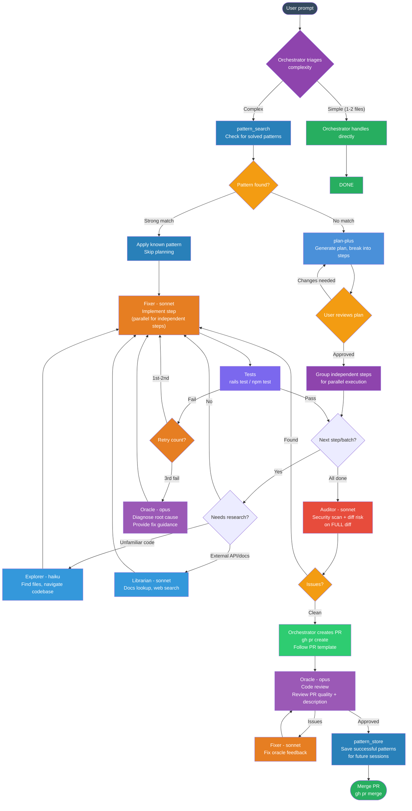

# Standard Development Flow

## Mermaid Diagram

## Flow Rules

### 1. Triage (Orchestrator — no agent cost)
- Simple tasks (1-2 files, clear change): handle directly, no plan needed
- Complex tasks: continue to pattern search + planning

### 2. Pattern Search (knowledge MCP)
- `pattern_search` for previously solved patterns
- Match found: apply pattern directly, skip full planning
- No match: proceed to plan-plus

### 3. Planning (plan-plus — ALWAYS for complex tasks)
- Generate structured plan with skeleton + files format
- User MUST review and approve before execution
- Changes loop back to re-plan

### 4. Execute Steps in Batches (then loop)
- Group independent steps for parallel execution
- Each fixer runs as `plan-plus:plan-plus-executor` subagent (ephemeral context)
- After each batch completes + tests pass, loop to next batch
- Continue until all steps done

### 5. Agent Model Routing
| Agent | Model | When |
|-------|-------|------|
| Explorer | haiku | File discovery, codebase navigation |
| Librarian | sonnet | Docs, API lookup, web search |
| Fixer | sonnet | All implementation work |
| Auditor | sonnet | Security scan, diff risk analysis |
| Oracle | opus | Code review, stuck diagnosis only |
| Orchestrator | opus | Triage, PR creation (no agent cost) |

### 6. Test + Retry
- Run tests after each step/batch
- Retry fixer up to 2x on failure
- 3rd failure: escalate to Oracle (opus) for root cause diagnosis
- Oracle provides guidance → Fixer implements fix

### 7. Audit (once, on FULL diff before PR)
- Security scan + diff risk on the complete branch diff
- Runs after ALL steps pass tests
- Uses sonnet for thoroughness

### 8. PR Creation (Orchestrator — no agent cost)
- Orchestrator creates PR directly via `gh pr create`
- Follows repo's `.github/PULL_REQUEST_TEMPLATE.md`

### 9. Code Review (Oracle — opus, one call)
- Reviews full PR diff + title + description
- Checks: N+1, security, architecture, test coverage, PR quality
- Issues → Fixer fixes → Oracle re-reviews
- Approved → proceed to learn + merge

### 10. Learn (pattern_store)
- `pattern_store` successful patterns via knowledge MCP
- Tags: task type, files touched, approach used
- Future sessions retrieve instead of re-reasoning

### 11. Auto-Dream (Stop hook — background)
- Runs on session end (every 5 sessions / 24h)
- Consolidates memory, removes duplicates, prunes stale entries
- Uses haiku in background — zero interactive cost
