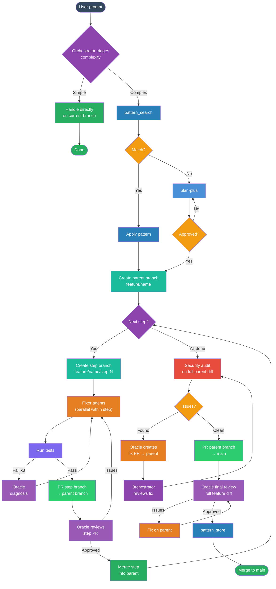

# Standard Development Flow

## Mermaid Diagram



## Branch Naming Convention

| Prefix | When to use | Example |
|--------|------------|---------|
| `feature/` | New functionality, screens, endpoints | `feature/user-onboarding` |
| `fix/` | Bug fixes | `fix/login-redirect-loop` |
| `improvement/` | Refactors, performance, code quality | `improvement/query-optimization` |
| `security/` | Security patches, vulnerability fixes | `security/xss-sanitization` |
| `test/` | Adding/improving tests only | `test/backend-model-coverage` |
| `docs/` | Documentation changes only | `docs/api-reference` |
| `chore/` | Dependencies, config, CI, tooling | `chore/upgrade-rails-8.2` |
| `hotfix/` | Urgent production fixes | `hotfix/payment-crash` |

**Step branches** append `/step-N` to the parent: `feature/user-onboarding/step-1`

**Rules:**
- Always kebab-case
- Short but descriptive
- Never generic (`feature/update`, `fix/bugfix`)

## Branching Strategy

```
main
 └── <prefix>/name              ← parent branch (1 per plan)
      ├── <prefix>/name/step-1  ← PR #1 → parent
      ├── <prefix>/name/step-2  ← PR #2 → parent (after #1 merged)
      ├── <prefix>/name/step-3  ← PR #3 → parent
      └── (all steps merged)
           └── security audit on parent
                ├── issues → oracle fix PR → parent
                └── clean → PR parent → main
```

## Flow Rules

### 1. Triage (Orchestrator — no agent cost)
- Simple tasks (1-2 files, clear change): handle directly, no plan needed
- Complex tasks: continue to pattern search + planning

### 2. Pattern Search (knowledge MCP)
- `pattern_search` for previously solved patterns
- Match found: apply pattern directly, skip full planning
- No match: proceed to plan-plus

### 3. Planning (plan-plus — ALWAYS for complex tasks)
- Generate structured plan with skeleton + files format
- User MUST review and approve before execution
- Changes loop back to re-plan

### 4. Branching
- Create parent branch: `feature/<plan-name>` from main
- Each step gets its own branch: `feature/<plan-name>/step-N` from parent
- Steps are sequential — step-2 branch created after step-1 PR is merged into parent

### 5. Execute Steps (sequential, parallel fixers within)
- For each step:
  1. Create step branch from parent
  2. Dispatch fixer(s) — parallel for independent sub-tasks within the step
  3. Run tests
  4. Create PR: step branch → parent branch
  5. Oracle reviews step PR
  6. Merge step PR into parent
  7. Loop to next step

### 6. Agent Model Routing
| Agent | Model | When |
|-------|-------|------|
| Explorer | haiku | File discovery, codebase navigation |
| Librarian | sonnet | Docs, API lookup, web search |
| Fixer | sonnet | All implementation work |
| Auditor | sonnet | Security scan, diff risk analysis |
| Oracle | opus | Code review, stuck diagnosis, security fixes |
| Orchestrator | opus | Triage, PR creation (no agent cost) |

### 7. Test + Retry
- Run tests after each step
- Retry fixer up to 2x on failure
- 3rd failure: escalate to Oracle (opus) for root cause diagnosis
- Oracle provides guidance → Fixer implements fix

### 8. Security Audit (once, after ALL steps merged into parent)
- Run on the full parent branch diff vs main
- Auditor (sonnet) scans for security issues, N+1, diff risk
- If issues found: Oracle creates a fix PR into parent branch
- Orchestrator reviews oracle's fix (acts as PM/lead)
- Re-audit until clean

### 9. Final PR: Parent → Main
- Create PR from parent branch into main
- Oracle does final review on the complete feature diff
- Reviews: code quality, PR title/description, architecture, test coverage
- Issues → fix on parent → re-review
- Approved → learn + merge

### 10. Learn (pattern_store)
- `pattern_store` successful patterns via knowledge MCP
- Tags: task type, files touched, approach used
- Future sessions retrieve instead of re-reasoning

### 11. Auto-Dream (Stop hook — background)
- Runs on session end (every 5 sessions / 24h)
- Consolidates memory, removes duplicates, prunes stale entries
- Uses haiku in background — zero interactive cost
